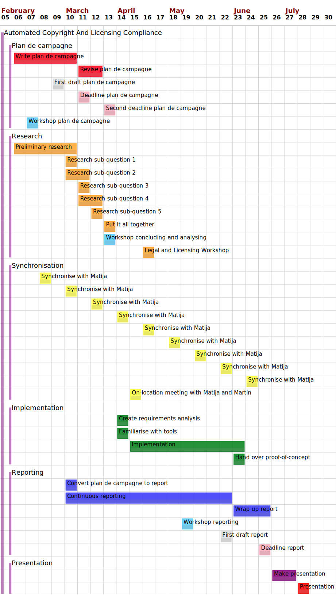

# Introduction {-}

This is the *plan de campagne* (plan of action, Dutch: plan van aanpak) for my
end-of-study internship. I am Carmen Bianca Bakker, and follow a bachelor in
software engineering (Dutch: informatica) at NHL Stenden University of Applied
Sciences. My internship is at Liferay International Ltd. in Dublin, a daughter
company of Liferay Inc. in Californa, United States. The companies will
henceforth be referred to as simply "Liferay". The internship lasts
approximately 5 months between 3 February 2020 and 30 June 2020. My job title at
Liferay is "Paralegal Engineering Intern".

The plan de campagne will detail the context of the internship, the problem that
I was brought in to solve, the research that will be conducted to form the basis
of a requirements analysis, the project that will be undertaken, and the
planning to bind everything together.

The shortest summary of the internship is:

> The work that goes into \gls{copyright} and licensing compliance at Liferay is
> currently manual. By the end of the internship, many of these processes will
> be automated.

Appendix \ref{crash-course} contains a crash course on \gls{copyright} and
licensing. It is recommended reading for readers who are unfamiliar with
\gls{foss} licensing. These concepts will not be explained elsewhere in the
document, which facilitates reading.

Find below an overview of the contents of the chapters:

- Chapter \ref{context}: \nameref{context} --- Provides the context for the
  internship, as well as a description of the problem.

- Chapter \ref{project-definition}: \nameref{project-definition} --- Defines the
  goals and deliverables of the project.

- Chapter \ref{research}: \nameref{research} --- Defines the research questions
  and their methods.

- Chapter \ref{project-activities}: \nameref{project-activities} --- Details the
  phases and anticipated activities of the project.

- Chapter \ref{project-boundaries}: \nameref{project-boundaries} --- Details
  what is, and---more importantly---what isn't part of the internship.

- Chapter \ref{quality-assurance}: \nameref{quality-assurance} --- Defines the
  methods through which the quality of the product is assured.

- Chapter \ref{planning}: \nameref{planning} --- Lays out intended dates for all
  activities.

# Context {#context}

This chapter details the context in which the internship takes place. It also
describes the problem that the internship is supposed to tackle, why this
problem is important, and therefore the motivation for the internship project.

## Liferay

Liferay Inc. is an international enterprise that is chiefly responsible for the
Liferay Digital Experience Platform (DXP), a large suite of web applications and
a platform on which to build applications. Liferay's mission statement is "By
building a vibrant business, making technology useful, and investing in
communities, we make it possible for people to reach their full potential to
serve others." Its slogan is "Enterprise. Open Source. For Life."
[@liferay-about]

## Legal

The "\gls{open-source}" aspect of Liferay involves \gls{foss} licensing.
Licensing involves Legal. This internship takes place within the context of
Liferay's Legal department. I will be working under Matija Šuklje, Senior
Counsel at Liferay. Matija is chiefly responsible for Liferay's \gls{ip},
specifically anything that involves the "©" symbol and software \gls{copyright}
and licensing. The "™" symbol is managed by Kirstin Huniar, and is not relevant
to this internship. [@suklje-2019]

Beside \gls{foss} licensing, Legal is also responsible for all other matters of
law. Like trademarks, these are not relevant to the internship, but mentioned
for completeness' sake.

## Engineering

Though this internship does not take place within the context of Liferay's
Engineering department, it is nevertheless important. Engineering is responsible
for creating Liferay's products. As part of creating Liferay's products, they
almost always interact with \gls{foss}---either Liferay's, or a dependency's.

## Dublin office

Liferay has offices all over the globe. Its global headquarters are in Diamond
Bar, Los Angeles County. The international office is in Dublin, which is the
site of this internship. The Dublin office hosts approximately twenty employees
working on Human Resources, Legal, finances, sales, consulting, and other.
Remote workers are also registered as working for the Dublin office.

(For posterity's sake---although the manual says otherwise---the office is
described *after* the departments because departments span offices.)

## The problem {#the-problem}

This section describes the problem curtly using the 6W method. [@verhoeven-2018,
chap. 3, sec. 3.2] The questions were posed to Matija Šuklje, and paraphrased
here.

#### What {-}

Liferay has a lot of software under various \glspl{license}. Liferay gives legal
assurances to its customers about its \gls{ip}, and therefore needs to make sure
that all code is correctly licensed. However, the current methods of assuring
the correctness of its licensing are manual[^manual]. This does not scale in an
economically viable way.

[^manual]: The current methods are not entirely manual. State-of-the-art tooling
is used by legal experts during the compliance process. However, this is
comparable to the difference between touching up a photo by hand and using a
professional image manipulation program: A computer makes the process a lot
easier, but a human still has to do it.

#### Who {-}

Legal is responsible for verifying the licensing of Liferay's products.
Engineering interacts with licensed products, and may be affected by steps taken
to address the problem.

Matija Šuklje is the instigator of the project to tackle this problem.

#### When {-}

"When" is not strictly applicable, although the issue started being more
apparent as the product became too big to audit manually on a commercially
reasonable scale.

#### Why {-}

The work on licensing compliance is important for several reasons:

- Potential \gls{copyright} violations provide legal and reputational risks, and
  potential loss of revenue and business.
- \Gls{copyright} violations would also affect customers, who would be in breach
  of \gls{copyright} law.
- Crudely put, breaking \gls{copyright} law is illegal. [@berne-1886]

The manual work is a problem because:

- manual verification of licensing takes up a lot of (expensive) time by legal
  experts;
- when a problem is identified, the feedback loop between Legal and Engineering
  is inefficient, and creates a bottleneck.

#### Where {-}

"Where" is not strictly applicable. The problem is in the codebase.

#### The cause {-}

The main cause of the problem is the quantity of files that need to be checked
for compliance. A small amount of files can be verified by hand, but thousands
cannot. Alternatively, there would be no need to verify compliance if all
engineers were completely diligent in introducing copyrighted code. However,
human error is unavoidable, so verification is mandatory.

## Gap analysis of the problem

This section aims to simplify the fractured description in section
\ref{the-problem} with a gap analysis. The gap analysis is explicitly
as-short-as-possible to capture the essence of the problem.

> The current process of licensing compliance is manual. This takes a lot of
> time.
>
> The desired process of licensing compliance is automated. This saves a lot of
> time, and improves accuracy.

## History

There is some tangent history to the problem, but the exact lines are blurry.
Liferay has an \gls{inbound} and \gls{outbound} licensing policy
[@liferay-inbound; @liferay-outbound], but they do not scale without better
interconnection and automation.

Liferay's internal *Source Formatter* tool [@liferay-source-formatter] also
checks some licensing compliance aspects, but it is not thorough enough. Source
Formatter is run as a linter in Liferay's \gls{ci} system, and is used locally
by engineers during the development process.

Liferay also uses FOSSology and FOSSID as tools that reduce the workload of
Legal, but they are not automated.

## The project

The project of this internship is---in the simplest of terms---to make the
problem as described above go away. Chapter \ref{project-definition}
describes the project in full. This section details the context of the project.

Liferay is the *ordering party* (client, Dutch: opdrachtgever) of the project.
Matija Šuklje is the ordering party personified. The ordering party:

- describes the problem;
- provides resources to investigate the problem;
- describes further requirements and limitations;
- provides continuous feedback on the direction of the project;
- provides a working environment;
- provides assistance where needed.

I (Carmen Bianca Bakker) am the *delivering party* (contractor, Dutch:
opdrachtnemer) of the project. The delivering party:

- investigates the problem;
- performs research to form the basis of a requirements analysis;
- creates a requirements analysis;
- acts as project lead on the project to tackle the problem;
- creates a product to solve the problem;
- tests the product;
- writes a report on the process.

These items are performed to the best of my abilities considering the
educational context within which the internship takes place.

## Detailed problem context

Section \ref{the-problem} gave the bare minimal problem description. Anything
more would have muddied the essence of the problem. However, more context is
needed to understand some things in later chapters.

**Notice to the reader:** Feel free to skip this section or briefly skim over
it. Later chapters will refer back to these sections when the context is needed.

### Liferay Portal {#liferay-portal}

Liferay Digital Experience Platform (DXP) is the main product of Liferay. It is
the enterprise version of Liferay Portal. The two products are virtually
identical, but Liferay DXP has some added functionality, better support, and
additional benefits for subscribers. Liferay Portal is \gls{upstream} to Liferay
DXP.

Liferay Portal is licensed under the terms of the GNU Lesser General Public
License as published by the Free Software Foundation, either version 2.1 of the
\gls{license}, or any later version. It consists of approximately
80,000[^liferay-source-files] files, out of which ±32,000[^liferay-java-files]
are Java code files. [@liferay-portal]

[^liferay-source-files]: `find . type -f | wc -l`

[^liferay-java-files]: `find . type -f -name "*.java" | wc -l`

Liferay DXP is licensed under a private \gls{license} instead of the GNU Lesser
General Public License. See section \ref{copyright-assignment}.

### License headers {#license-headers}

By and large, the \gls{copyright} and licensing of a file is defined in its
comment header. In Liferay Portal, the Java files have a standardised header as
shown in listing \ref{lst:java-header}.

```{#lst:java-header caption="Comment header that contains Liferay's licensing blurb."}
/**
 * Copyright (c) 2000-present Liferay, Inc. All rights reserved.
 *
 * This library is free software; you can redistribute it and/or modify it under
 * the terms of the GNU Lesser General Public License as published by the Free
 * Software Foundation; either version 2.1 of the License, or (at your option)
 * any later version.
 *
 * This library is distributed in the hope that it will be useful, but WITHOUT
 * ANY WARRANTY; without even the implied warranty of MERCHANTABILITY or FITNESS
 * FOR A PARTICULAR PURPOSE. See the GNU Lesser General Public License for more
 * details.
 */
```

@liferay-policy-marking-code identifies several problem with the current comment
headers: "[N]o coherent policy applied to all projects; years not updated; the
use of 'present' in the year span, which is useless at best and misleading at
worst; use of obsolete 'All rights reserved', which is neither needed nor true,
as the very next line gives rights through a \gls{foss} \gls{license}; does not
include a contact point to the \gls{copyright-holder}."

When Liferay DXP---which is licensed under a proprietary EULA---is released,
these headers are replaced.

### Copyright assignment {#copyright-assignment}

Liferay Portal uses a policy of \gls{copyright} assignment. This means that all
third-party contributors to Liferay Portal must sign an agreement wherein they
transfer ("assign") their \gls{copyright} to Liferay. If the agreement is not
signed, then the contributions are not accepted. [@liferay-cla]

Employee contributions always assign their \gls{copyright} to the employer
(Liferay).

The logical consequence of this policy is that all code inside of Liferay Portal
is exclusively copyrighted by Liferay[^not-exclusive]. This allows Liferay to
offer their product under a separate \gls{license} to paying customers. This
frees those customers from the obligations of the GNU Lesser General Public
License.

[^not-exclusive]: This is not entirely true. There exists third-party \gls{foss}
inside of Liferay Portal. The \glspl{license} of these components permit
relicensing under a \gls{proprietary} \gls{license}.

### SPDX and REUSE {#spdx-reuse}

This internship heavily builds upon the foundations laid by \gls{spdx} by the
Linux Foundation and REUSE by the Free Software Foundation Europe. \gls{spdx} is
an open standard for communicating software bill of material infomation. REUSE
is a project that makes makes licensing easy, comprehensive, and
machine-readable. REUSE itself incorporates \gls{spdx}.

The \gls{outbound} licensing policy of Liferay is a superset of REUSE.

This internship takes place within the wider context of the SPDX and REUSE
communities. It is likely that there may be expertise exchange within these
communities. Moreover, a presence within these communities is a great boon for
one's professional development.

# Project definition {#project-definition}

In this chapter, we define the parameters of the project. Specifically, this
chapter defines the end result of the project.

## Ideal situation

In order to give some context for the goals in section \ref{goals}, these are
some qualities of the ideal situation:

- Licensing problems get addressed much earlier during the development cycle.

- The feedback loop between Legal and Engineering is shortened.

- Total time spent working on this by Legal and Engineering is reduced to a
  minimum.

- Quality of licensing compliance improves.

## Goals {#goals}

In coming up with a goal, it was quickly evident that it would be difficult to
formulate the main goal into a SMART goal. So instead of doing that, a broader
goal was chosen, with the implicit understanding that the goal would be met if
all SMART sub-goals are completed.

The main goal of the project is:

> Improve and automate \gls{inbound} and \gls{outbound} licensing compliance.

The sub-goals of the project are informed by the desires of Liferay. They are as
follows:

### Follow industry best-practices by providing unified and unambiguous licensing information in all source code files {#goal-reuse}

This resolves the problem mentioned in section \ref{license-headers}.
@liferay-outbound now mandates the use of a different header, but it has not
been implemented yet. The new header can be seen in listing
\ref{lst:reuse-header}.

```{#lst:reuse-header caption="New copyright and licensing header template for Liferay."}
/**
 * SPDX-FileCopyrightText: © {year_of_creation} Liferay, Inc. <https://liferay.com>
 * SPDX-License-Identifier: {spdx_license_short_identifier}
 */
```

The new Liferay policy is informed by the REUSE project [@fsfe-reuse]. See
section \ref{spdx-reuse}.

There are going to be some challenges in implementing this policy, but it is
equally important that the policy be tested against. Therefore, this sub-goal
has one sub-goal of its own:

- Automatically verify (lint) the codebase against Liferay's \gls{outbound}
  licensing policy.

There is one optional sub-goal. As described in section
\ref{copyright-assignment} and section \ref{license-headers}, Liferay offers a
separately licensed version of their product to paying customers. From that fact
stems the following sub-goal:

- Unify the licensing header for both the community and the enterprise version
  of Liferay Portal. See section \ref{liferay-portal}.

This sub-goal might be tricky from a legal perspective, though, and remains
entirely optional.

### Automatically check licensing of all inbound third-party code, and flag Legal if a problem is detected

All code that enters the project must have its licensing checked. More often
than not, it will be a contribution authored by an employee, which means that
the \gls{inbound} licensing is not a concern. If the employee commits code that
was authored by somebody else, however, the licensing must be double-checked.

The method of implementation is not yet certain, and will require research.
Preliminary research suggests that the code could be verified against a
"plagiarism checker" and a decision tree. The complexity of such a plagiarism
checker is much greater, however, because not only must one check for duplicity,
but also for the licensing of the original code. The decision tree is as complex
as the licensing policy that informs it.

To reduce the complexity of the sub-goal into tangible parts, it would be fair
to split this sub-goal up into a few more sub-goals:

- Automatically check whether \gls{inbound} code is first-party or third-party.

- Automatically check the licensing of \gls{inbound} third-party code.

- Verify whether the licensing of \gls{inbound} third-party code is compatible
  according to @liferay-inbound.

- Flag Legal if a problem is detected.

### Facilitate the production of a bill of materials that covers all outbound licensing {#goal-bom}

**Important:** This is an *optional* goal that may not be completed if time is
tight. If time is not tight, or if another step went much quicker than
anticipated, this goal is an excellent extension of the internship.

When the goal in section \ref{goal-reuse} is completed, it should be much easier
to automatically generate a bill of materials of Liferay's products. Such a bill
of materials currently exists, but lacks granularity and depends on a product's
globally *declared* licensing instead of its *detected* licensing. Moreover, it
is provided as a PDF file, which may not be the most convenient for some use
cases.[^bom]

[^bom]: There also exist \gls{spdx} files for Liferay Portal/DXP and some other
products, but they are not automated and there is a considerable backlog.

As such, a mechanism for the production of a bill of materials can be created
that incorporates the detected licensing. One strong candidate for the output
format is \gls{spdx}, an open standard for communicating software bill of
material information.

The desired granularity of the output is left unspecified and depends on the
available time.

## Deliverables

By the end of the internship, several things will be delivered. It is difficult
to anticipate the exact details, because the research is intended to discover
the best solution. Nevertheless, a curt overview of deliverables:

- This plan de campagne.

- A research document.

- A requirements analysis.

- The report mandated by NHL Stenden. The research document is contained within
  this report.

- A product, or a combination of products, that automate \gls{copyright} and
  licensing compliance.

- Documentation that assists in the integration of the delivered product(s).

- A pull request that alters the licensing headers in the source code.

# Research {#research}

The research component of this internship has one very clear purpose: To form
the foundation of the requirements analysis at the start of the software
development cycle. For that reason, the research will be focused on discovering
all factors adjacent to the requirements analysis.

## Main question

The main question spawns forth from two requirements of Liferay: Liferay wishes
to know the licensing of \gls{inbound} code, and wishes to verify its
\gls{outbound} licensing. They wish to do these things in an automated fashion.
Reorder the words, and this becomes the main question of research:

> Given Liferay’s demands, requirements and limitations, what are suitable
> solutions for automating Liferay's \gls{inbound} and \gls{outbound} licensing
> policies?

## Sub-questions {#sub-questions}

Because main questions need sub-questions, this section details five of them.

The first two sub-questions directly elaborate on the main question in ways that
are hopefully obvious:

@needs. What are the demands, requirements and limitations of Liferay?

@solutions. What are the available technical solutions in the field of
licensing compliance? What are their qualities?

Question @needs seeks to define some important terms in the main question.
Question @solutions seeks to acquire information about existing technical
approaches to adjacent problems, if any. It will also zoom in on the extent of
automation: Which scenarios should require manual intervention by Legal or
Engineering? These existing technical solutions may inform the product, or may
be consumed by the product.

The next questions explore aspects that are directly tangential to the main
question. These aspects will be important to research.

@current. What is the current process of licensing compliance?

@methods. What are the possible methods of detecting the \gls{inbound}
licensing of code? What are their qualities?

Question @current exists to create an understanding of the current situation.
With that understanding, it becomes much easier to imagine how the process might
be automated.

Question @methods looks similar to question @solutions, but they are in truth
extremely different. Where question @solutions is focused on the technical
aspect and available technical solutions, question @methods is non-technical and
should not necessitate a single line of code. It is concerned with extracting
information from data. Figuring out how to do this is important for the product.

Which leaves the last question:

@measure. Is it possible to measure the quality of licensing? If so, how?

This question is slightly out-of-scope for main question, but completely
in-scope for the requirements analysis and project goals, which is why it is
here. One of the goals of the project is to improve the licensing. The answer
to question @measure allows us to test the quality of the delivered work.

## Definitions

In line with Verhoeven [-@verhoeven-2018, chap. 5], find here a clarification of
the terms used in the main question.

- Demands, requirements and limitations --- Sub-question @needs from section
  \ref{sub-questions} will fully detail what these words actually entail. For
  the purposes of this section, consider this a combination of Liferay's wants
  and limits.

- Suitable --- This word can be perceived as subjective. Its intent, however, is
  to see whether a solution is fit for purpose when compared to the
  requirements, and to what extent.

- Solution --- A solution is the project as a whole. It is not an off-the-shelf
  product that can be implemented, but may involve using and mixing and matching
  off-the-shelf components into a greater whole.

- Automating --- Partially or completely reduce the necessity for a human to be
  involved in the process.

- \Gls{inbound} and \gls{outbound} licensing policies --- Both internal
  documents. [@liferay-inbound;@liferay-outbound]

## Sources

Although it is impossible to know now which sources will end up being useful,
and which sources will be encountered in the process of research, here are some
sources that are likely to be useful:

- ClearlyDefined (Open Source Initiative)
- Creative Commons
- Debian
- Fedora
- FOSSID
- FOSSology (Linux Foundation)
- Free Software Foundation
- OSS Review Toolkit
- REUSE (Free Software Foundation Europe)
- ScanCode (nexB)
- Software Package Data Exchange Workgroup (Linux Foundation)
- SW360 (Eclipse)

Some of these sources are also used in this document.

## Method

This section describes the intended methods of research for each sub-question.
These methods are sourced from @ictresearchmethods. They are not further
described for the sake of brevity---the aforementioned source contains their
descriptions. The rationales are described, however.

#### What are the demands, requirements and limitations of Liferay? {-}

- Stakeholder analysis --- The stakeholders assuredly possess the knowledge to
  answer this question.

#### What are the available technical solutions in the field of licensing compliance? What are their qualities? {-}

- Available product analysis --- Requires no rationale.

#### What is the current process of licensing compliance? {-}

- Expert interview --- An expert can perfectly describe the current process.
- Observation --- Observing the current process may give insights that do not
  arise from the interview.

#### What are the possible methods of detecting the inbound licensing of code? What are their qualities? {-}

- Brainstorm --- This is a practical problem that could be solved in multiple
  ways. Because the likely methods are currently unknown, they could be
  unearthed through brainstorming.
- Expert interview --- An interview with an expert can uncover the qualities of
  the discovered methods.

#### Is it possible to measure the quality of licensing? If so, how? {-}

- Literature study --- This question is highly theoretical. It is possible that
  someone else has written about this before.
- Available product analysis --- This method may or may not be relevant. Someone
  may have written a product that measures licensing quality. Analysing these
  products may give insight into how the measurements are done.

## Requirements analysis

After the research has been completed, a requirements analysis will be produced
that will form the basis of the design for the product.

# Project activities {#project-activities}

I have organisationally split up the project in six phases. Each phase gets a
section in this chapter. For the reader's convenience, the activities are each
one item in a bullet list. Not all activities can be anticipated, and not all
anticipated activities may actually end up happening. The activities are
more-or-less chronological, but become asynchronous as implementation begins.

## Plan de campagne

- Discuss the problems with Matija.

- Create a plan de campagne.

- Organise the research.

- Provide a first draft.

- Provide a final draft.

## Research

- Perform preliminary research.

- Perform research. The exact activities are detailed in chapter \ref{research}
  and will not be repeated here.

- Document the research into the report.

## Synchronisation {#synchronisation}

- Do biweekly meetings with Matija to stay on-path.

- Perhaps stating the obvious: Regularly communicate with Matija between the
  biweekly meetings to resolve issues early.

## Implementation

- Create a requirements analysis from the conclusion of the research.

- Acquire the minimum amount of skills necessary to create the product (e.g.
  catch up on a new programming language or framework).

- Create a rudimentary high-level design for the product. This design need not
  be thorough---it need only be sufficient to get started with the development
  feedback loop. Most of the design will be informed by test-driven development.
  See rationale in section \ref{tdd}.

- Create all (anticipated) issues in an issue tracker.

- Implement the product with test-driven development.

- If possible, set up continuous testing.

- Continuously document the product.

- Obtain feedback during the creation of the product. Open and resolve issues
  depending on the feedback.

- Request code reviews during the creation of the product.

- Write a separate tool that adjusts the headers to be compliant with the
  \gls{outbound} policy.

- Hand over the code to Engineering. The chances of seeing the product
  implemented in Liferay in the last weeks of the internship are slim, but it
  will be sufficiently documented for the implementer.

## Reporting

- Maintain a daily log of activities.

- Convert the plan de campagne into the report. This is a real time-saver.

- Continuously document activities into the report. If this is diligently done,
  the hope is that it saves a lot of time at the end.

- Figure out a way to use visuals in a way that this plan de campagne has not.

- After implementation is done, spend two or three weeks doing finishing touches
  to the report.

- Provide a first draft.

- Provide the final report.

## Presentation

- Very little can be said about this. After the deadline of the report, spend
  some time working on the presentation.

# Project boundaries {#project-boundaries}

This chapter covers the boundaries of the internship, which for this project are
relatively simple.

## In-scope

The goals of the project are well-defined in section \ref{goals}. Everything
that furthers those goals is obviously within the boundaries of the project.
Importantly, section \ref{goal-bom} lists an optional goal that may or may not
be feasibly completed.

During the first weeks of the implementation phase of the project, *definitions
of done* will be produced that set the exact scope of the project. For now, the
definition of done is a simple question: Are the goals in section \ref{goals}
completed? The reason that the definitions of done will be produced during the
early implementation phase is because, by then, it will be much clearer what the
project looks like, what is feasible, and what problems are especially difficult
to solve. These things are not clear yet.

Documentation and testing of the produced product is within the boundaries of
the project.

## Out-of-scope

As part of the internship, there will be communication/co-operation with the
wider software licensing community. Any tasks that stem from that co-operation
are *outside of the boundaries* of the project, but may be taken on if time
allows. This co-operation is immeasurably valuable for both Liferay and for my
professional development. See section \ref{spdx-reuse}.

Although a product will be delivered during the internship, integration is
out-of-scope. Someone within Liferay will---or will not---integrate the product
into Liferay's internal systems.

In order to simplify the internship, every repository other than Liferay Portal
(section \ref{liferay-portal}) is out-of-scope. The purpose of this project is
to be applicable to other Liferay repositories as well, but for scope reasons,
this internship will only focus on Liferay Portal.

# Quality assurance {#quality-assurance}

The quality of the product will be assured through three measures.

## Test-driven development {#tdd}

Test-driven development (TDD) is a software development process in which test
cases are written before the implementation is written. The tests inform the
design of the implementation. As an added bonus, you get a test suite that tests
every single feature. The test suite is run regularly to guarantee that no new
bugs have been introduced.

Test-driven development as a methodology does not mix well with up-front design.
Writing the tests *is* the design process. For this reason, the up-front design
will be high-level rather than low-level. This allows a lot of flexibility while
still providing some structure.

An added benefit of test-driven development is that, ideally, you do not end up
with more functionality than you strictly need.

## Code review

Though I will not receive a code review for every single feature or pull
request, I will semi-regularly request code reviews to make sure that the
written code is up-to-standard.

## Synchronisation with stakeholders

In a scrum-like fashion, I will regularly synchronise with the primary
stakeholder to make sure that the product delivers the features it should. These
meetings are biweekly. See section \ref{synchronisation}.

# Planning {#planning}

This chapter covers the timing and planning of the internship. It is expressly
kept short in the interest of being to-the-point. For more details, see chapter
\ref{project-activities}.

## Chronological planning

The format is MM-DD. The year is implicitly 2020.

- 02-03 --- Begin internship.

- 02-07 --- First meeting with Matija.

- 02-11 --- Workshop plan de campagne.

- 02-28 --- First draft plan de campagne.

- 03-09 --- **Deadline: Plan de campagne.**

- 03-23 --- **Deadline: Plan de campagne (retry).**

- 03-24 --- Workshop analysis and conclusions.

- 03-27 --- **Internal deadline: Research.**

- 03-30 --- Create requirements analysis.

- 04-06 --- On-location meeting. This date is *not final*.

- 04-06 --- Begin implementation period.

- 04-15 --- Legal and Licensing Workshop in Barcelona.

- 05-04 --- Workshop reporting.

- 05-25 --- First draft report.

- 06-05 --- **Internal deadline: Hand over proof-of-concept.**

- 06-05 --- Cease implementation period.

- 06-19 --- **Deadline: Report.**

- 07-[6,7,10] --- **Deadline: Presentation in Leeuwarden.**

{#gantt}

Figure \ref{gantt} displays a Gantt chart of the planning. It is separated in
six: Plan de campagne, research, synchronisation, implementation, reporting, and
presentation. These six segments are colour-coded. Workshops, drafts, and
deadlines get their own colours: soft blue, white, and soft pink respectively.

## Legal and Licensing Workshop

The Free Software Foundation Europe annually organises the Legal and Licensing
Workshop (LLW) in Barcelona. Due to my work on REUSE and my field expertise in
copyright and licensing, I have been invited to attend. The LLW is not strictly
related to the internship, but it is a wonderful opportunity for professional
growth, networking, and learning.

Moreover, there will be plenty field experts present at the event. Although the
research phase is over by April, there will be the opportunity to pick the
brains of these experts. Some of these experts may be the \glspl{author} of
solutions mentioned in research sub-question @solutions.

See also section \ref{spdx-reuse}.

\appendix

# Crash course in copyright and licensing {#crash-course}

This appendix aims to provide a crash course in \gls{copyright} and licensing.
It is designed to be comprehensive-but-concise.

## What is copyright?

According to @cc-faq: "\Gls{copyright} law grants exclusive rights to creators
of original works of authorship, [...] prohibiting the making of copies without
the rights holder’s permission, among other things. [...] \Gls{copyright} in
most jurisdictions attaches automatically without need for any formality once a
creative work is fixed in tangible form. [...] In some jurisdictions, creators
may be required to register with a national agency in order to enforce
\gls{copyright} in court."

The Berne Convention [-@berne-1886] is an international agreement between
nations that forms the basis of much of \gls{copyright} law. It grants foreign
works the same protections as native works, and sets some minimum standards of
protection that all signatories must meet. The Berlin Act [-@berlin-1908]
introduces the concept that \gls{copyright} is enjoyed without being "subject to
any formality". In effect, this means that \gls{copyright} is granted as soon as
one's metaphorical pen is put to paper.

In order for a work to be eligible for \gls{copyright}, it must be original. In
this context, "'[o]riginal' means a work created through the 'fruits of
intellectual labor.' 'Originality' therefore requires not only that the
\gls{author} has not copied the work from another, but also that there is 'at
least some minimal degree of creativity.'" [@uslegal-originality]

There is no international threshold for originality. Countries create their own
thresholds for \gls{copyright} eligibility. In the Netherlands, in order for a
work to be copyrightable, the work must be perceivable by human senses; it must
have its own, original character and carry the mark of its maker; and the work
may not be solely necessary for the obtaining of a technical effect. Software is
an exception to this last item. [@auteursrecht-waarop]

The duration of \gls{copyright} differs across jurisdictions. In the European
Union, the Copyright Term Directive standardises \gls{copyright} duration to the
life of the \gls{author} and 70 years after their death, or 70 years after the
first lawful publication in case the \gls{author} is anonymous/pseudonymous.
[@copyright-term-directive]

The Berne Convention [-@berne-1886] and many other sources use the word
"\gls{author}" to refer to the person or organisation that holds the rights over
a certain work. In this document, "\gls{copyright-holder}" is consistently used
instead. The reason for this is that the \gls{author} is not always the
\gls{copyright-holder}---an \gls{author} may transfer their \gls{copyright} to
another party, such as when in the course of employment.
[@uk-ownership-copyright]

## What are licenses?

@reuse-faq says that "a \gls{license} defines the terms under which the
\gls{copyright-holder} allows the recipient of the \gls{license} to use the
software".

@choosealicense-no-license reasons that: "When you make a creative work (which
includes code), the work is under exclusive \gls{copyright} by default. Unless
you include a \gls{license} that specifies otherwise, nobody else can copy,
distribute, or modify your work without being at risk of take-downs,
shake-downs, or litigation. Once the work has other contributors (each a
\gls{copyright-holder}), 'nobody' starts including you", and adds that
"[d]isallowing use of your code might not be what you intend by 'no
\gls{license}.' An \gls{open-source} \gls{license} allows reuse of your code
while retaining \gls{copyright}."

A \gls{foss} \gls{license} grants certain rights to the recipient of the
\gls{license}. @fsf-free-sw says that a \gls{license} is a \gls{foss}
\gls{license} if it provides the user with four essential freedoms:

- “The freedom to run the program as you wish, for any purpose (freedom 0).
- The freedom to study how the program works, and change it so it does your
  computing as you wish (freedom 1). Access to the source code is a precondition
  for this.
- The freedom to redistribute copies so you can help others (freedom 2).
- The freedom to distribute copies of your modified versions to others (freedom
  3). By doing this you can give the whole community a chance to benefit from
  your changes. Access to the source code is a precondition for this.”

\Glspl{license} that do not provide the user with these freedoms, then, are
"\gls{proprietary}" or "\gls{non-free}" \glspl{license}.

@osi-osd has a similar requirement for a \gls{license} to be identified as a
\gls{foss} \gls{license}. It says that a \gls{license} must abide by the Open
Source Definition.

These two definitions often---but not always---result in the same
\glspl{license} being identified as \gls{foss} \glspl{license}.
[@spdx-license-list]

@choosealicense-no-license, @osi-faq, and @stallman-license-compatibility
identify two types of \glspl{license}: \Gls{permissive} and \gls{copyleft}.
@osi-faq says that a \gls{permissive} \gls{license} is "simply a
non-\gls{copyleft} \gls{open-source} \gls{license} --- one that guarantees the
freedoms to use, modify, and redistribute, but that permits \gls{proprietary}
derivative works." @fsf-copyleft says that \gls{copyleft} "is a general method
for making a program (or other work) free (in the sense of freedom, not 'zero
price'), and requiring all modified and extended versions of the program to be
free as well." This last requirement is the defining feature of \gls{copyleft}
\glspl{license}.

The GNU General Public License family of \glspl{license} and the Creative
Commons Attribution-ShareAlike family of \glspl{license} are some of the most
widely used \gls{copyleft} \glspl{license}. [@fsf-copyleft;@cc-licenses]

## A word on FOSS

This document uses \acrshort{foss} (\acrlong{foss}) as a catch-all name for both
\gls{open-source} and \gls{free-software}. Furthermore, this document regards
\gls{open-source} and \gls{free-software} to be synonyms for simplicity's sake.
This is in the understanding that they are incredibly similar. [@schiessle-2012]

According to @perens-2017, "\gls{open-source} \glspl{license} and
\gls{free-software} \glspl{license} are effectively the same thing." Perens is
the creator of the Open Source Definition.


## Outbound licenses

An \gls{outbound} \gls{license} is effectively the \gls{license} under which a
first party distributes their code. The word "\gls{outbound}" is only added to
contrast against \gls{inbound} \glspl{license}.

## Inbound licenses

According to @liferay-internal-faq, "an \gls{inbound} \gls{license} is one that
is coming into the project or product, [of which there are generally] two types:
[1] code you copied from an \gls{upstream} project --- which is the same as that
\gls{upstream} project's \gls{outbound} \gls{license}; and [2] code that was
contributed to one of our projects/products from an external party --- typically
by signing Liferay's CLA."

To paraphrase, all code and works that *enter* a project are covered by an
*\gls{inbound}* \gls{license}. The \gls{inbound} \gls{license} that a first
party receives is the \gls{outbound} \gls{license} of a third party.

\printnoidxglossary[sort=word]

# References {-}

<div id="refs"></div>
