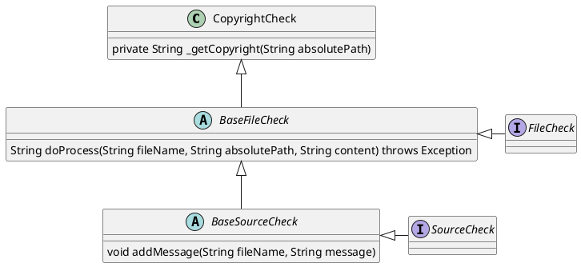

```plantuml
@startuml

class CopyrightCheck
abstract class BaseFileCheck
interface FileCheck
abstract class BaseSourceCheck
interface SourceCheck

CopyrightCheck <|-- BaseFileCheck
BaseFileCheck <|-- BaseSourceCheck
BaseFileCheck <|- FileCheck
BaseSourceCheck <|- SourceCheck

CopyrightCheck : private String _getCopyright(String absolutePath)

BaseFileCheck : String doProcess(String fileName, String absolutePath, String content) throws Exception

BaseSourceCheck : void addMessage(String fileName, String message)

@enduml
```