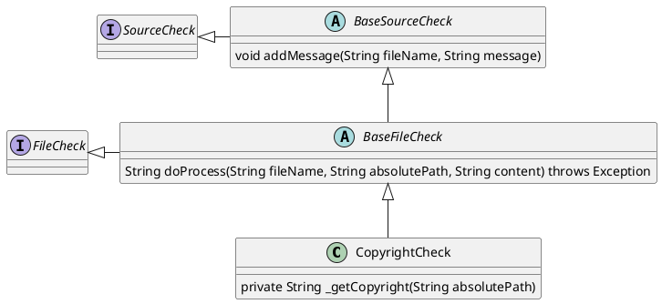

```plantuml
@startuml

class CopyrightCheck
abstract class BaseFileCheck
interface FileCheck
abstract class BaseSourceCheck
interface SourceCheck

BaseFileCheck <|-- CopyrightCheck
BaseSourceCheck <|-- BaseFileCheck
FileCheck <|- BaseFileCheck
SourceCheck <|- BaseSourceCheck

CopyrightCheck : private String _getCopyright(String absolutePath)

BaseFileCheck : String doProcess(String fileName, String absolutePath, String content) throws Exception

BaseSourceCheck : void addMessage(String fileName, String message)

@enduml
```
