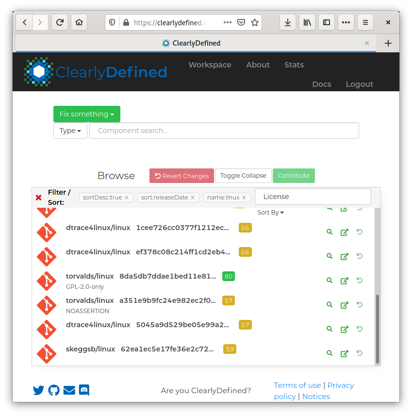
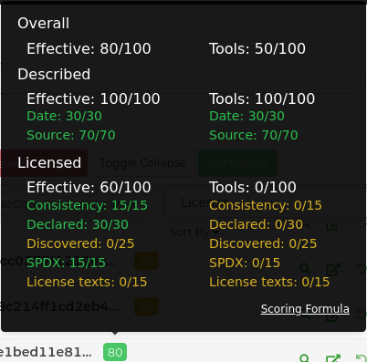
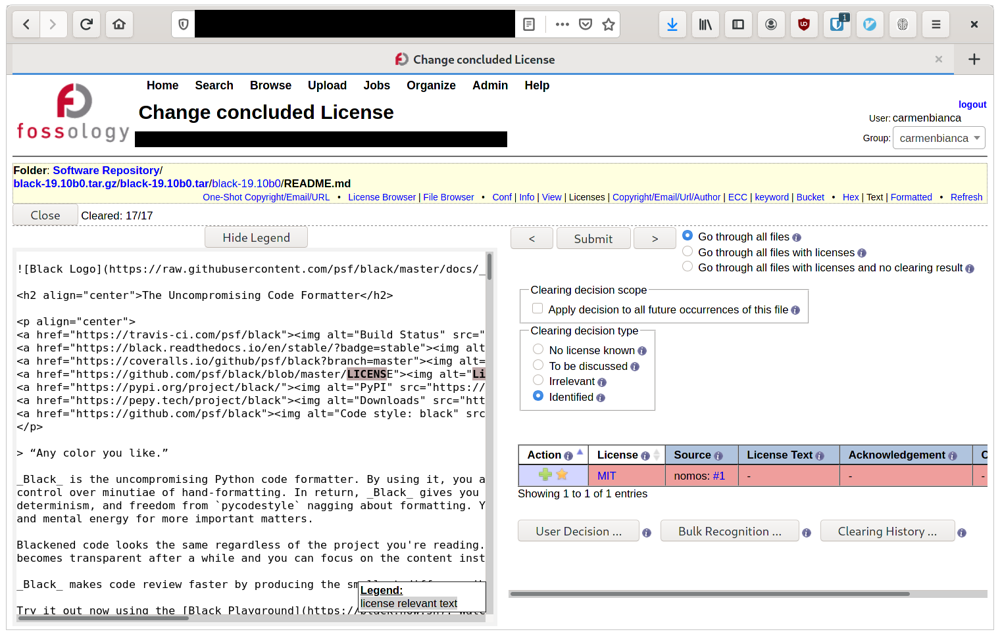
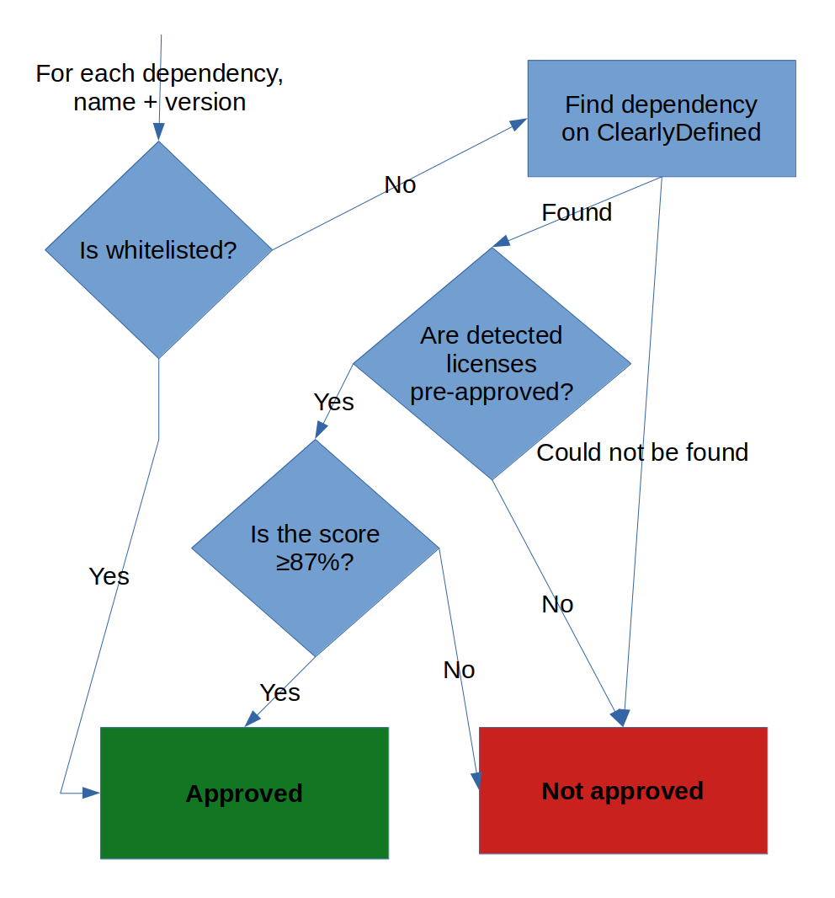
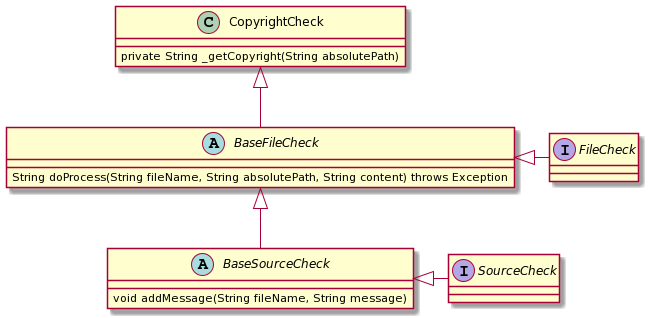
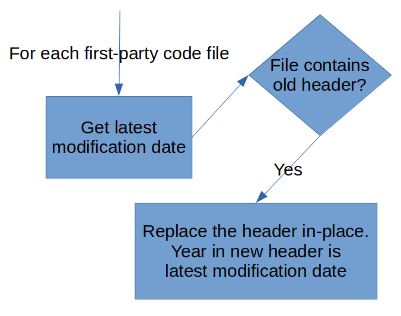
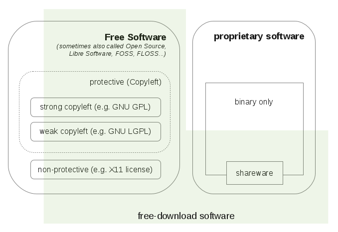

# Summary {-}

TODO

# Introduction

This is the final report for my end-of-study internship. I am Carmen Bianca
Bakker, and follow a bachelor in software engineering (Dutch: informatica) at
NHL Stenden University of Applied Sciences. My internship is at Liferay
International Ltd. in Dublin, a daughter company of Liferay Inc. in Californa,
United States. The companies will henceforth be referred to as simply "Liferay".
The internship lasts approximately 5 months between 3 February 2020 and 30 June
2020. My job title at Liferay is "Paralegal Engineering Intern".

The report will detail the context of the internship, the problem that I was
brought in to solve, the research that has been conducted to form the basis of a
requirements analysis, and the project has been undertaken.

The shortest summary of the internship is:

> The work that goes into \gls{copyright} and licensing compliance at Liferay is
> currently manual. By the end of the internship, many of these processes will
> be automated.

Appendix \ref{crash-course} contains a crash course on \gls{copyright} and
licensing. It is recommended reading for readers who are unfamiliar with
\gls{foss} licensing. These concepts will not be explained elsewhere in the
document, which facilitates reading.

Find below an overview of the contents of the chapters:

TODO

<!-- 
- Chapter \ref{context}: \nameref{context} --- Provides the context for the
  internship, as well as a description of the problem.
  -->

<!--
- Chapter \ref{project-definition}: \nameref{project-definition} --- Defines the
  goals and deliverables of the project.
-->

- Chapter \ref{research}: \nameref{research} --- Defines the research questions
  and their methods.

- Chapter \ref{project-activities}: \nameref{project-activities} --- Details the
  phases and anticipated activities of the project.

- Chapter \ref{project-boundaries}: \nameref{project-boundaries} --- Details
  what is, and---more importantly---what isn't part of the internship.

- Chapter \ref{quality-assurance}: \nameref{quality-assurance} --- Defines the
  methods through which the quality of the product is assured.

- Chapter \ref{planning}: \nameref{planning} --- Lays out intended dates for all
  activities.

There exists a glossary and list of references at the end. In case you are
reading this on a computer, you can click on some words to be taken to their
definition in the glossary. You can also click on the years of the references to
be taken to the correct reference entry.

## Context {#context}

This section details the context in which the internship takes place. It also
describes the problem that the internship tackles, why this problem is
important, and therefore the motivation for the internship project.

### Liferay

Liferay Inc. is an international enterprise that is chiefly responsible for the
Liferay Digital Experience Platform (DXP), a large suite of web applications and
a platform on which to build applications. Liferay's mission statement is "By
building a vibrant business, making technology useful, and investing in
communities, we make it possible for people to reach their full potential to
serve others." Its slogan is "Enterprise. Open Source. For Life."
[@liferay-about]

### Legal

The "\gls{open-source}" aspect of Liferay involves \gls{foss} licensing.
Licensing involves Legal. This internship takes place within the context of
Liferay's Legal department. I will be working under Matija Šuklje, Senior
Counsel at Liferay. Matija is chiefly responsible for Liferay's \gls{ip}. This
includes anything that involves the "©" symbol and software \gls{copyright} and
licensing, but also patents, database rights, design rights, and all other
\gls{ip}. The "™" symbol is managed by Kirstin Huniar, and is not relevant to
this internship. [@suklje-2019]

Beside \gls{foss} licensing, Legal is also responsible for all other matters of
law. Like trademarks, these are not relevant to the internship, but mentioned
for completeness' sake.

### Engineering

Though this internship does not take place within the context of Liferay's
Engineering department, it is nevertheless important. Engineering is responsible
for creating Liferay's products. As part of creating Liferay's products, they
almost always interact with \gls{foss}---either Liferay's, or a dependency's.

### Dublin office

Liferay has offices all over the globe. Its global headquarters are in Diamond
Bar, Los Angeles County. The international office is in Dublin, which is the
site of this internship. The Dublin office hosts approximately twenty employees
working on Human Resources, Legal, finances, sales, consulting, and other.
Remote workers are also registered as working for the Dublin office.[^order-note]

[^order-note]: For posterity's sake---although the manual says otherwise---the
office is described *after* the departments because departments span offices.

### The problem {#the-problem}

This section describes the problem curtly using the 6W method. [@verhoeven-2018,
chap. 3, sec. 3.2] The questions were posed to Matija Šuklje, and paraphrased
here.

#### What {-}

Liferay has a lot of software under various \glspl{license}. Liferay gives legal
assurances to its customers about its \gls{ip}, and therefore needs to make sure
that all code is correctly licensed. However, the current methods of assuring
the correctness of its licensing are manual[^manual]. This does not scale in an
economically viable way.

[^manual]: The current methods are not entirely manual. State-of-the-art tooling
is used by legal experts during the compliance process. However, this is
comparable to the difference between touching up a photo by hand and using a
professional image manipulation program: A computer makes the process a lot
easier, but a human still has to do it.

#### Who {-}

Legal is responsible for verifying the licensing of Liferay's products.
Engineering interacts with licensed products, and may be affected by steps taken
to address the problem.

Matija Šuklje is the instigator of the project to tackle this problem.

#### When {-}

"When" is not strictly applicable, although the issue started being more
apparent as the product became too big to audit manually on a commercially
reasonable scale.

#### Why {-}

The work on licensing compliance is important for several reasons:

- Potential \gls{copyright} violations provide legal and reputational risks, and
  potential loss of revenue and business.
- \Gls{copyright} violations would also affect customers, who would be in breach
  of \gls{copyright} law.
- Crudely put, breaking \gls{copyright} law is illegal. [@berne-1886]

The manual work is a problem because:

- manual verification of licensing takes up a lot of (expensive) time by legal
  experts;
- when a problem is identified, the feedback loop between Legal and Engineering
  is inefficient, and creates a bottleneck.

#### Where {-}

"Where" is not strictly applicable. The problem is in the codebase.

#### The cause {-}

The main cause of the problem is the quantity of files that need to be checked
for compliance. A small amount of files can be verified by hand, but thousands
cannot. Alternatively, there would be no need to verify compliance if all
engineers were completely diligent in introducing copyrighted code. However,
human error is unavoidable, so verification is mandatory.

### Gap analysis of the problem

This section aims to simplify the fractured description in section
\ref{the-problem} with a gap analysis. The gap analysis is explicitly
as-short-as-possible to capture the essence of the problem.

> The current process of licensing compliance is manual. This takes a lot of
> time.
>
> The desired process of licensing compliance is automated. This saves a lot of
> time, and improves accuracy.

### History

There is some tangent history to the problem, but the exact lines are blurry.
Liferay has an \gls{inbound} and \gls{outbound} licensing policy
[@liferay-inbound; @liferay-outbound], but they do not scale without better
interconnection and automation.

Liferay's internal *Source Formatter* tool [@liferay-source-formatter] also
checks some licensing compliance aspects, but it is not thorough enough. Source
Formatter is run as a linter in Liferay's \gls{ci} system, and is used locally
by engineers during the development process.

Liferay also uses FOSSology and FOSSID as tools that reduce the workload of
Legal, but they are not automated. These tools are behind a \gls{vpn}, and their
installations aren't actively maintained (i.e., may be behind on important
updates).

### The project

The project of this internship is---in the simplest of terms---to make the
problem as described above go away. Section \ref{project-definition} describes
the project in full. This section details the context of the project.

Liferay is the *ordering party* (client, Dutch: opdrachtgever) of the project.
Matija Šuklje is the ordering party personified. The ordering party:

- describes the problem;
- provides resources to investigate the problem;
- describes further requirements and limitations;
- provides continuous feedback on the direction of the project;
- provides a working environment;
- provides assistance where needed.

I (Carmen Bianca Bakker) am the *delivering party* (contractor, Dutch:
opdrachtnemer) of the project. The delivering party:

- investigates the problem;
- performs research to form the basis of a requirements analysis;
- creates a requirements analysis;
- acts as project lead on the project to tackle the problem;
- creates a product to solve the problem;
- tests the product;
- writes a report on the process.

These items are performed to the best of my abilities considering the
educational context within which the internship takes place.

### Detailed problem context

Section \ref{the-problem} gave the bare minimal problem description. Anything
more would have muddied the essence of the problem. However, more context is
needed to understand some things in later chapters.

**Notice to the reader:** Feel free to skip this section or briefly skim over
it. Later chapters will refer back to these sections when the context is needed.

#### Liferay Portal {#liferay-portal}

Liferay Digital Experience Platform (DXP) is the main product of Liferay. It is
the enterprise version of Liferay Portal. The two products are virtually
identical, but Liferay DXP has some added functionality, better support, and
additional benefits for subscribers. Liferay Portal is \gls{upstream} to Liferay
DXP.

Liferay Portal is licensed under the terms of the GNU Lesser General Public
License as published by the Free Software Foundation, either version 2.1 of the
\gls{license}, or any later version. It consists of approximately
80,000[^liferay-source-files] files, out of which ±32,000[^liferay-java-files]
are Java code files. [@liferay-portal]

[^liferay-source-files]: `find . type -f | wc -l`

[^liferay-java-files]: `find . type -f -name "*.java" | wc -l`

Liferay DXP is licensed under a private \gls{license} instead of the GNU Lesser
General Public License. See section \ref{copyright-assignment}.

#### License headers {#license-headers}

By and large, the \gls{copyright} and licensing of a file is defined in its
comment header. In Liferay Portal, the Java files have a standardised header as
shown in listing \ref{lst:java-header}.

When Liferay DXP---which is licensed under a proprietary EULA---is released,
these headers are replaced.

```{#lst:java-header caption="Comment header that contains Liferay's licensing blurb."}
/**
 * Copyright (c) 2000-present Liferay, Inc. All rights reserved.
 *
 * This library is free software; you can redistribute it and/or modify it under
 * the terms of the GNU Lesser General Public License as published by the Free
 * Software Foundation; either version 2.1 of the License, or (at your option)
 * any later version.
 *
 * This library is distributed in the hope that it will be useful, but WITHOUT
 * ANY WARRANTY; without even the implied warranty of MERCHANTABILITY or FITNESS
 * FOR A PARTICULAR PURPOSE. See the GNU Lesser General Public License for more
 * details.
 */
```

@liferay-policy-marking-code identifies several problem with the current comment
headers: "[N]o coherent policy applied to all projects; years not updated; the
use of 'present' in the year span, which is useless at best and misleading at
worst; use of obsolete 'All rights reserved', which is neither needed nor true,
as the very next line gives rights through a \gls{foss} \gls{license}; does not
include a contact point to the \gls{copyright-holder}."

@liferay-outbound now mandates the use of a different header, but it has not
been widely implemented yet. The new header can be seen in listing
\ref{lst:liferay-header}.

```{#lst:liferay-header caption="New copyright and licensing header template for Liferay."}
/**
 * SPDX-FileCopyrightText: © {year_of_creation} Liferay, Inc. <https://liferay.com>
 * SPDX-License-Identifier: {spdx_license_short_identifier}
 */
```

The new Liferay policy is informed by the REUSE project [@fsfe-reuse]. See
section \ref{spdx-reuse}.

#### Copyright assignment {#copyright-assignment}

Liferay Portal uses a policy of \gls{copyright-assignment}. This means that all
third-party contributors to Liferay Portal must sign an agreement wherein they
transfer ("assign") their \gls{copyright} to Liferay. If the agreement is not
signed, then the contributions are not accepted. [@liferay-cla]

Employee contributions always assign their \gls{copyright} to the employer
(Liferay).

The logical consequence of this policy is that all code inside of Liferay Portal
is exclusively copyrighted by Liferay[^not-exclusive]. This allows Liferay to
offer their product under a separate \gls{license} to paying customers. This
frees those customers from the obligations of the GNU Lesser General Public
License.

[^not-exclusive]: This is not entirely true. There exists third-party \gls{foss}
inside of Liferay Portal. The \glspl{license} of these components permit
relicensing under a \gls{proprietary} \gls{license}.

#### SPDX and REUSE {#spdx-reuse}

This internship heavily builds upon the foundations laid by \gls{spdx} by the
Linux Foundation and REUSE by the Free Software Foundation Europe. \gls{spdx} is
an open standard for communicating software bill of material information. REUSE
is a project that makes makes licensing easy, comprehensive, and
machine-readable. REUSE itself incorporates \gls{spdx}.

The \gls{outbound} licensing policy of Liferay is a superset of REUSE.

This internship takes place within the wider context of the \gls{spdx} and REUSE
communities. It is likely that there may be expertise exchange within these
communities. Moreover, a presence within these communities is a great boon for
one's professional development.

## Project definition {#project-definition}

In this section, we define the parameters of the project. Specifically, this
section defines the end result of the project.

### Ideal situation

In order to give some context for the goals in section \ref{goals}, these are
some qualities of the ideal situation:

- Licensing problems get addressed much earlier during the development cycle.

- The feedback loop between Legal and Engineering is shortened.

- Total time spent working on this by Legal and Engineering is reduced to a
  minimum.

- Quality of licensing compliance improves.

### Goals {#goals}

The main goal of the project is to *improve and automate \gls{inbound} and
\gls{outbound} licensing compliance*. However, this goal is not very SMART, so a
different SMART main goal has been formulated. As follows:

> Automatically check licensing of all **\gls{inbound}** third-party code, and
> follow industry best-practices by providing unified and unambiguous licensing
> information for all **\gls{outbound}** code.

This main goal is necessarily two-pronged, with an equal focus on \gls{inbound}
and \gls{outbound} licensing. This is a minor annoyance, but unavoidable.
Focusing exclusively on one or the other would not solve the stated problems in
section \ref{context}.

Therefore it is likely---but not necessary---that two technological solutions
are provided instead of one, or that a single technological solution is provided
with a very clear split down the middle between the \gls{outbound} licensing
component and the \gls{inbound} licensing component.

#### Automate verification of inbound licensing {#goal-inbound}

All code that enters the project must have its licensing checked. More often
than not, it will be a contribution authored by an employee, which means that
the \gls{inbound} licensing is not a concern. If the employee commits code that
was authored by somebody else, however, the licensing must be double-checked.

The method of implementation is not yet certain, and will require research and
deliberation. Some options are concretely mentioned here to give this goal some
more tangibility. Preliminary research suggests that incoming libraries could be
checked against their declared manifest, or against a public database that holds
the licensing information of many packages. Alternatively, the code could be
verified against a "plagiarism checker" on a snippet level, but this might be
too complex and/or resource-intensive.

To reduce the complexity of this goal into tangible parts, it would be fair to
split it up into a few sub-goals:

- Write a mechanism that automatically checks whether \gls{inbound} code is
  first-party or third-party.

- Write a mechanism that automatically checks the licensing of \gls{inbound}
  third-party code.

- Write a mechanism that verifies whether the licensing of \gls{inbound}
  third-party code is compatible according to @liferay-inbound.

- Write a mechanism that flags Legal if a problem is detected.

#### Automate verification of outbound licensing {#goal-reuse}

Automating \gls{outbound} licensing compliance is closely related to the problem
in section \ref{license-headers}. There are going to be some challenges in
implementing this policy, but it is equally important that the policy be tested
against. Therefore, this goal presents the following sub-goals:

- Write a mechanism that converts the licensing headers in Liferay's codebase to
  the format found in listing \ref{lst:liferay-header}. This is a single-use
  mass-conversion program that does not need to be maintained or rigorously
  designed.

- Write a mechanism that automatically verifies (lints) the codebase against
  Liferay's \gls{outbound} licensing policy.

There is one optional sub-goal. As described in section
\ref{copyright-assignment} and section \ref{license-headers}, Liferay offers a
separately licensed version of their product to paying customers. From that fact
stems the following sub-goal:

- Unify the licensing header for both the community and the enterprise version
  of Liferay Portal. See section \ref{liferay-portal}.

This sub-goal might be tricky from a legal perspective, though, and remains
entirely optional. And it is, as far as this internship is concerned,
out-of-scope from a software engineering perspective.

#### Facilitate the production of a bill of materials that covers all outbound licensing {#goal-bom}

TODO: Maybe scrap this?

**Important:** This is an *optional* sub-goal that may not be completed if time
is tight. If time is not tight, or if another step went much quicker than
anticipated, this goal is an excellent extension of the internship.

When the goal in section \ref{goal-reuse} is completed, it should be much easier
to automatically generate a bill of materials of Liferay's products. Such a bill
of materials currently exists, but lacks granularity and depends on a product's
globally *declared* licensing instead of its *detected* licensing. Moreover, it
is provided as a PDF file, which may not be the most convenient for some use
cases.[^bom]

[^bom]: There also exist \gls{spdx} files for Liferay Portal/DXP and some other
products, but they are not automated and there is a considerable backlog.

As such, a mechanism for the production of a bill of materials can be created
that incorporates the detected licensing. One strong candidate for the output
format is \gls{spdx}, an open standard for communicating software bill of
material information.

The desired granularity of the output is left unspecified and depends on the
available time.

### Deliverables {#deliverables}

By the end of the internship, several things will be delivered. It is difficult
to anticipate the exact details, because the research is intended to discover
the best solution. Nevertheless, a curt overview of deliverables:

- A plan de campagne.

- This report mandated by NHL Stenden.

- A product, or a combination of products, that automate \gls{copyright} and
  licensing compliance. Section \ref{goal-inbound} and \ref{goal-reuse} provide
  rough sketches of the requirements of these products.

- A simple program, as described in section \ref{goal-reuse}, that mass-converts
  Liferay's codebase to use the new licensing headers.

- Optional: A program, as described in section \ref{goal-bom}, that produces a
  bill of materials for Liferay's products.

- Documentation that assists in the integration of the delivered product(s). See
  section \ref{out-of-scope}

# Research {#research}

The research component of this internship has one very clear purpose: To form
the foundation of the requirements analysis at the start of the software
development cycle. For that reason, the research will be focused on discovering
all factors adjacent to the requirements analysis.

## Main question

The main question spawns forth from two requirements of Liferay: Liferay wishes
to know the licensing of \gls{inbound} code, and wishes to verify its
\gls{outbound} licensing. They wish to do these things in an automated fashion.
Reorder the words, and this becomes the main question of research:

> Given Liferay's demands, requirements, and limitations, what is the
> most[^most] suitable software solution for automating Liferay's \gls{inbound}
> and \gls{outbound} licensing policies?

[^most]: The word "most", in this context, reflects back on the demands,
requirements, and limitations. I have received advice against using this word. I
am using it regardless because I firmly believe that it conveys something
essential to the research. The goal of the research is to identify a single
solution going forward---possibly out of many. Asking the question "how can one
build a software solution [given the requirements, etc. etc. etc]?" as suggested
in the manual does not produce the same output. As a sanity check, I have
verified my main question with Lisette Derksen (research coach at NHL Stenden),
who approved my decision.

## Sub-questions {#sub-questions}

Because main questions need sub-questions, this section details three of them.
There had been five in an earlier submission, but due to time constraints, it
has been trimmed down to three.

@current. What is the current process of licensing compliance?

@needs. What are the demands, requirements, and limitations of Liferay in the
context of automating their licensing policies?

@solutions. What are the available technical solutions in the field of
licensing compliance? Which of these are suitable for automating Liferay's
licensing policies?

Question @current exists to create an understanding of the current situation.
With that understanding, it becomes much easier to imagine how the process might
be automated.

Question @needs seeks to define some important terms in the main question.
Acquiring a deeper understanding of Liferay's wants helps the project to focus
on those specific wants.

Question @solutions seeks to acquire information about existing technical
approaches to adjacent problems, if any. It will also zoom in on the extent of
automation: Which scenarios should require manual intervention by Legal or
Engineering? These existing technical solutions may inform the product, or may
be consumed by the product.

The answers to these three questions grant a deep enough understanding to
confidently answer the main question.

## Definitions

In line with Verhoeven [-@verhoeven-2018, chap. 5], find here a clarification of
the terms used in the main question.

- Demands, requirements, and limitations --- Sub-question @needs from section
  \ref{sub-questions} will fully detail what these words actually entail. For
  the purposes of this section, consider this a combination of Liferay's wants
  and limits.

- Suitable --- This word can be perceived as subjective. Its intent, however, is
  to see whether a solution is fit for purpose when compared to the
  requirements, and to what extent.

- Solution --- A solution is the project as a whole. It is not an off-the-shelf
  product that can be implemented, but may involve using and mixing and matching
  off-the-shelf components into a greater whole.

- Automating --- Partially or completely reduce the necessity for a human to be
  involved in the process.

- \Gls{inbound} and \gls{outbound} licensing policies --- Both internal
  documents. [@liferay-inbound;@liferay-outbound]

## Sources

Although it is impossible to know now which sources will end up being useful,
and which sources will be encountered in the process of research, here are some
sources that are likely to be useful:

- ClearlyDefined (Open Source Initiative)
- Creative Commons
- Debian
- Fedora
- FOSSID
- FOSSology (Linux Foundation)
- Free Software Foundation
- OSS Review Toolkit
- REUSE (Free Software Foundation Europe)
- ScanCode (nexB)
- Software Package Data Exchange Workgroup (Linux Foundation)
- SW360 (Eclipse)

Some of these sources are also used in this document.

## Methods

This section describes the intended methods of research for each sub-question.
These methods are sourced from @ictresearchmethods. The methods are broadly
defined and a rationale for each method is given.

### What is the current process of licensing compliance? {#interview-process}

In order to assess the current processes, an *expert interview* will be
conducted with Matija Šuklje. The expert interview will focus on a handful of
things:

- What is the most common licensing compliance issue?
- How and by whom are licensing compliance issues reported to Legal?
- Does Legal search for licensing compliance issues? If so, how?
- What are the steps that are taken when a licensing compliance issue pops up?
- Where in the process does Liferay lose the most time?

These questions are intended to reveal the process and its pain points.

The interview will take place over VOIP software. I will ask the participant for
permission to record the interview. The interview will not be wholly transcribed
for time's sake, but the recording exists as reference material to aid in
paraphrasing the interviewee's answers. The recording will be deleted in July at
the end of the internship.

The rationale for an expert interview is simple: There is no doubt in my mind
that an expert knows the process well, and is familiar enough with the process
to detect its pain points.

### What are the demands, requirements, and limitations of Liferay in the context of automating their licensing policies?

One part of this sub-question is extremely easy to address: @liferay-inbound and
@liferay-outbound already give a lot of information on Liferay's requirements
from a policy perspective. Researching these documents is *document analysis*.

But those are only the things that are written down. It is probable that there
are other wants or restrictions that are not black-on-white. To discover those,
I will *explore user requirements*. Exploring user requirements will be a number
of interviews with people who are somehow related to the project. These people
are:

- Dang Minhchau --- Technical Support Lead (Engineering)
- Hugo Huijser --- Author of Source Formatter (Engineering, Testing/QA)
- Matija Šuklje --- Senior Counsel (Legal)
- Peter Yoo --- Senior Software Engineer in Testing (Testing/QA)

Like in section \ref{interview-process}, the interviewee will be asked for
permission to record, and the recordings will be deleted in July.

I have prepared questions for three fields---Engineering, Legal, and Testing/QA.
They are listed here in subsections. In parentheses after interviewee is the
field I will ask questions about.

Some questions below are out-of-scope in the sense that they do not answer the
stated sub-question, but try to further clarify the current situation. These
questions technically belong in preliminary research, but they are retained here
because they were part of the same interview.

The goal is chiefly to clarify obvious questions, and to discover unknown
unknowns. Towards that end, many of the questions are open-ended. The method of
interviewing people from different fields was chosen because this project is
inherently interdisciplinary, and I will need input from all fields to get a
broader picture of the requirements.

#### Engineering

- When during the development process do you test/lint?
- How do you test/lint? Locally or via CI?
- How do you make the decision to use third-party code/libraries? Does licensing
  factor into this decision?
- During which stage of development do you see yourself using a compliance tool?
- During which stage of development do you NOT see yourself using a compliance
  tool?
- How quickly do you need feedback about whether you can use third-party code or
  not?

#### Legal

In contrast to questions from the other subsections, these questions are highly
specific. A lot of preliminary research has already answered the most important
questions. These questions, then, are super-specific to aid in the upcoming
requirements analysis.

- Does the automated solution need to do snippet-level scanning?
- Does the automated solution need to verify the licensing of third-party
  libraries that are introduced?
  + Only included libraries (e.g., *.jar* copied into the repository), or any
    declared dependencies?
  + When should third-party libraries be verified? Only when introduced? Every
    time the tool is run?
  + What to do when the solution identifies a third-party library as being
    incompatible, but manual review says otherwise? Should there be a manual
    curation flag?
  + When issues in licensing are discovered, should those issues be addressed
    upstream? How?
- Does the codebase need to be fully REUSE-compliant? i.e., licensing headers in
  *every single file*. If partial, which parts?
- Does the automated tool need to check for compatible licenses? Should this be
  a whitelist and a blacklist? A complex decision tree?
- In Liferay Portal, is any copyright statement other than "Copyright Liferay"
  permissible? Is it only permissible for non-\gls{copyleft} licenses?

#### Testing/QA

- What CI system does Liferay use?
- How much CPU time is a licensing solution entitled to? Real time?
- How often can/should the licensing solution run? When (in the development
  process) should it run?
- If problems are detected, is it possible to do automated interaction with the
  ticket system? Would manual interaction be preferable?
- When a REUSE check fails, should the entire test fail?
- What language or framework ought to be used for a solution?
- Can a CI step make calls to a third-party internet API? Does this violate
  reproducibility?

### What are the available technical solutions in the field of licensing compliance? Which of these are suitable for automating Liferay's licensing policies?

There are various existing technical solutions in the field of licensing
compliance. An *available product analysis* is made of these solutions. In
co-operation with Matija, a shortlist was created. The shortlist consists of:

- ClearlyDefined
- FOSSology
- REUSE
- ScanCode
- SW360

FOSSID and OSS Review Toolkit were also on the shortlist, but have been removed
for want of time.

The method of evaluating these solutions is a simple linear path:

1. Read about the product in its existing documentation.

2. Install the product (if applicable). This step seems superfluous, but was
   retroactively introduced into the method, as will become evident in the
   results of some of the solutions.

3. Use the product, preferably on Liferay Portal. This step is ill-defined
   because of the variation between the solutions. It is exploratory
   observation---discovering the unknown.

4. Read other people's reviews or comments about the product.

Once these steps are through, the findings are assessed to determine their
applicability to this internship.

The rationale for choosing this method is hopefully self-explanatory. There are
available products, and they need to be analysed.

## Requirements analysis

After the research has been completed, a requirements analysis will be produced
that will form the basis of the design for the product.

# Execution of research {#execution-of-research}

This chapter details the execution and results of the research described in
chapter \ref{research}. Section \ref{research-conclusion} concludes the
sub-questions and endeavours to answer the main question of the research. The
sub-questions are collectively concluded in that section instead of separately
within their respective sections for the reader's comfort---it's much easier to
read the conclusion to the main question when the conclusions to the
sub-questions aren't scattered in between the results.

<!--
This section describes the intended methods of research for each sub-question.
These methods are sourced from @ictresearchmethods. They are not further
described for the sake of brevity---the aforementioned source contains their
descriptions. The rationales are described, however.
-->

## What is the current process of licensing compliance?

I interviewed Matija Šuklje with the questions from section
\ref{interview-process}. The answers are paraphrased here.

#### What is the most common licensing compliance issue [in Liferay]? {-}

Matija identified the most likely candidate to be "not fulfilling all formal
obligations of certain \glspl{license}." As an example, the Apache \gls{license}
requires you to keep notice files, a requirement that is not always met.

Additionally, although Liferay provides information about its licensing, not all
information is ideally presented or curated, especially in the case of
third-party software. Matija indicated that usually the information from the
third-party packages' manifests is presented, which isn't necessarily the most
accurate reflection of reality. Some customers would like this to be handled
better.

#### How and by whom are licensing compliance issues reported to Legal? {-}

Licensing compliance issues are reported through JIRA tickets, using the
"\gls{foss} Project" ticket category. There are separate ticket types for
\gls{inbound} and \gls{outbound} issues. Anyone can make these tickets, but
usually it's developers themselves, developer leads, or product managers.

However, a good portion of developers aren't familiar with \gls{open-source}.
Matija affirmed that some developers could not give a sufficient definition of
\gls{foss}, instead roughly defining it as "when you can see the source code".

#### Does Legal search for licensing compliance issues? If so, how? {-}

The short answer to this is yes. Matija follows several keywords (e.g.,
"\gls{open-source}", "\gls{copyright}", etc.) in JIRA. Whenever one such keyword
is mentioned in an issue, Matija gets a notification.

Furthermore, scans using FOSSology and FOSSID are done for releases of Liferay.
This process finds licensing compliance issues without depending on reports from
others.

#### What are the steps that are taken when a licensing compliance issue pops up? {-}

Matija answered this question by referencing an existing \gls{foss}
non-compliance procedure. The document is marked for internal use only, and
cannot be paraphrased in this report. Suffice it to say, the non-compliant code
is reworked in such a manner that it is no longer non-compliant.

@liferay-outbound also references how to make sure whether third-party code is
permissible. Paraphrased: One must identify all the licenses of the third-party
code, and verify whether they are on a pre-approved list. FOSSology and
ClearlyDefined are approved methods of detecting the licenses, with the caveat
that the score in ClearlyDefined must be 87% or above.

#### Where in the process does Liferay lose the most time? {-}

Matija identified two time gaps:

- It takes a while for developers to flag issues. Sometimes issues are flagged
  rather late into the development process.

- The process of manual scanning is time-intensive. Although automated scanning
  has gone from days to hours, the manual review is tedious. Matija also
  identified a problem with FOSSID (a compliance tool) where he must first
  resolve a lot of false positives before he can find the true positives.

## What are the demands, requirements, and limitations of Liferay in the context of automating their licensing policies?

This section contains paraphrased interviews. The interviews are sorted
alphabetically by the surname of the interviewee.

### Interview with Dang Minhchau

TODO Description of Minhchau

#### When during the development process do you test/lint? {-}

Minhchau occasionally runs small tests during the development process of a
feature. The big suite of tests is only run near the end, just before a pull
request is submitted for inclusion in the main development branch.

The rationale for only running the entire suite once near the end is that it
takes a long time to run all tests.

#### How do you test/lint? Locally or via CI? {-}

Minhchau runs the linter locally, but all other tests are run via the CI. The
rationale is the same as for the previous question.

#### How do you make the decision to use third-party code/libraries? Does licensing factor into this decision? {-}

Minhchau admitted that he probably was not the correct person to ask this
question. In his position, he does not bring in new libraries---only upgrade
existing ones.

He did know the general answer to this, however. New libraries must be
justified. If there is no clear advantage to using the library, it cannot be
included.

Minhchau also identified two separate cases for using third-party libraries: Use
with intent to distribute, and use without intent to distribute. Minhchau
occasionally uses libraries without intent to distribute. When he does this, he
is not overly concerned with licensing, only pricing.

Minhchau did not know the process for selection of a new library.

#### During which stage of development do you see yourself using a compliance tool? {-}

Assuming that the header check is integrated into Source Formatter, Minhchau said
that he would run that before creating a pull request, like he usually does with
Source Formatter.

A check that verifies whether a library is permissible would be run during the
CI. However, Minhchau said that it would be nice to do this check locally for
sanity's sake.

Minhchau said that developers occasionally create a pull request against their
own branch. By creating this pull request, they trigger a CI build. The specific
CI steps that are run for the pull request can be specified with a "CI command".
It would be nice if there were a separate CI command for the verification of the
licensing of libraries.

#### During which stage of development do you NOT see yourself using a compliance tool? {-}

Minhchau said that he might use such a tool at the start or at the end, but not
in the middle.

#### How quickly do you need feedback about whether you can use third-party code or not? {-}

Minhchau said that he would like feedback ideally within a week.

### Interview with Hugo Huijser

TODO description of Hugo.

#### What CI system does Liferay use? {-}

Liferay uses Jenkins.

#### How much CPU time is a licensing solution entitled to? Real time? {-}

Hugo wasn't able to answer this question.

#### What language or framework ought to be used for a solution? {-}

Within Liferay, the most common languages are Java and JavaScript, with a little
bit of Python. The solution should probably use one of these languages.

#### Can a CI step make calls to a third-party internet API? Does this violate reproducibility? {-}

The CI step can make calls to a third-party API. Some current CI steps also
require connection with a third-party API, such as downloading information from
package repositories.

Hugo said that is is likely that this might violate reproducibility, but did not
view this as especially troublesome.

#### When during the development process do you test/lint? {-}

Hugo runs tests after making changes, before submitting a pull request.

#### How do you test/lint? Locally or via CI? {-}

Hugo runs small tests locally, and big tests via Liferay's CI.

#### How do you make the decision to use third-party code/libraries? Does licensing factor into this decision? {-}

Hugo said that the answer to this depends on what one needs. Often when you need
a library, you can find that it is already being used in another module. In such
a case, Hugo said that he (perhaps naively) assumes that the library is fine to
use in his own module as well.

If the library is not already being used, Hugo goes to the library's website and
broadly checks whether it is \gls{open-source} or not. He does not check the
specific \gls{license}.

#### During which stage of development do you see yourself using a compliance tool? {-}

Hugo uses Source Formatter before submitting a pull request, reasoning that if a
pull request is sent to the chief software architect without running
Source Formatter, the tests will fail.

Usually, the last commit of a PR is a Source Formatter run.

Relevant to this internship, Source Formatter currently verifies that the header
from \ref{#lst:java-header} is present in source files.

#### During which stage of development do you NOT see yourself using a compliance tool? {-}

Hugo had no specific answer for this other than "any time".

#### How quickly do you need feedback about whether you can use third-party code or not? {-}

Hugo said that if it takes a couple of days, that's fine. However, he said that
his job is not in a customer-facing context, so the answer might be different
for someone else.

### Interview with Matija Šuklje {#interview-with-matija}

TODO description here

#### Does the automated solution need to do snippet-level scanning? {-}

Matija said that this would be nice to have, but is probably not needed. Or
rephrased, snippet-level scanning is an ambitious goal that makes sense for a
future revision.

#### Should only included libraries (e.g., *.jar* copied into the repository) have their licensing verified, or any declared dependencies? {-}

Both would be nice. At a minimum the code that is actually included should be
verified.

#### When should third-party libraries be verified? Only when introduced? Every time the tool is run? {-}

Matija said that the check obviously needs to run at least once. It makes sense
to synchronise this with engineering.

Running the check only once when introduced is technically sufficient, but it
might be nice to do a full re-run every now and again (yearly, or pre- or
post-release).

#### What to do when the solution identifies a third-party library as being incompatible, but manual review says otherwise? Should there be a manual curation flag? {-}

The solution should be overridden somehow, probably through some kind of
configuration file. Matija recounted something of the sort also being done in
the software that generates the list of third-party software.

In the configuration file, it would be nice to have a link to the issue that
resolved the conflict.

#### When issues in licensing are discovered, should those issues be addressed upstream? How? {-}

Matija said that this is not a hard requirement, but something that Liferay
would like to do. Specifically, it is hard to have a procedure in place for
this, because it's a manual human process. Matija illustrated this by implying
that there is a difference between informing a company of a licensing issue, and
approaching an amateur programmer who had published some script to the internet.

#### Does the codebase need to be fully REUSE-compliant? i.e., licensing headers in *every single file*. If partial, which parts? {-}

Matija was quick to point out that that is what the policy says. In the same
sentence, he also emphasised that it was going to be very very difficult to
actually get that done. Therefore, the answer is more along the lines of:
Ideally yes, realistically only the source code that Liferay owns.

#### Does the automated tool need to check for compatible licenses? Should this be a whitelist and a blacklist? A complex decision tree? {-}

Matija said that this would be hard to automate, especially in complex cases.
The simple solution would be to begin implementation with a simple whitelist
and/or blacklist, and add a decision tree later. This is lazy, but a good start.

#### In Liferay Portal, is any copyright statement other than "Copyright Liferay" permissible? Is it only permissible for non-\gls{copyleft} licenses? {-}

It might make sense to have the format be more free-form. It is currently very
strict (even a mismatch of a single character is a failure), and not necessarily
reflective of reality. Matija gave an example of some non-LGPL JavaScript code
being relicensed to LGPL upon inclusion into the Liferay Portal repository
because Source Formatter wouldn't accept anything else, which isn't strictly
necessary.

Some \glspl{license} other than LGPL might make sense for inclusion---probably a
whitelist of a limited amount of pre-approved \glspl{license}.

Moreover, although Liferay currently uses a system of
\gls{copyright-assignment}, it is possible to imagine a scenario where there is
another \gls{copyright-holder} who consents to Liferay's dual licensing.

The general answer to this, therefore, is that it might make sense to loosen up
the current strict requirements.

### Interview with Peter Yoo

TODO description of Peter

#### How much CPU time is a licensing solution entitled to? Real time? {-}

Peter Yoo said that there is no specific limit on CPU time, but that Liferay is
always looking to run as quickly as possible. Especially if a test is run very
quickly, even a little bit adds up.

Therefore, Peter Yoo suggested an upper bound along the lines of five minutes.

#### How often can/should the licensing solution run? When (in the development process) should it run? {-}

Peter Yoo suggested that Matija might be able to answer this. Ideally it would
be run as part of every pull request. The rationale for this is that the pull
request is the soonest intervention moment.

Matija can answer this? Ideally as part of every PR. Soonest intervention moment
is PR.

#### If problems are detected, is it possible to do automated interaction with the ticket system? Would manual interaction be preferable? {-}

This is not currently done anywhere in Liferay, but it might be possible.
Typically the extent of the current integration is an e-mail or Slack
notification.

Implementing this is not a must.

#### When a REUSE check fails, should the entire test fail? {-}

Peter had a simple answer to this: Yes.

The entire test also fails when there is a single formatting error spotted by
Source Formatter, so this is not out of the ordinary.

#### What language or framework ought to be used for a solution? {-}

According to Peter, the most likely candidate is Bash, Ant, Java, or some
combination of those. Ant is specifically mentioned because all of the testing
scaffolding is implemented in Ant instead of Jenkins.

A proof-of-concept in another language would be fine, but not preferable from
Liferay's point of view.

#### Can a CI step make calls to a third-party internet API? Does this violate reproducibility? {-}

Peter said that this is possible, but Liferay tries to avoid making too many API
calls. Otherwise certain services might be overwhelmed by the traffic coming
from Liferay's employees and CI system.


## What are the available technical solutions in the field of licensing compliance? Which of these are suitable for automating Liferay's licensing policies?

The following sections each contain the results of the applied method.

### ClearlyDefined

#### Documentation

All information in this section is sourced from @clearlydefined-docs.

ClearlyDefined is an "incubator project" under the Open Source Initiative, with
roots in the Microsoft Open Source Programs Office. Some other partners of
ClearlyDefined are Amazon, nexB (authors of ScanCode), Software Heritage,
Eclipse, Qualcomm, and Google.

ClearlyDefined is "on a mission to help \gls{foss} projects thrive by being
[...] clearly defined. Lack of clarity around \glspl{license} and security
vulnerabilities reduces engagement – that means fewer users, fewer contributors
and a smaller community. [...] This is a community-wide challenge that needs a
community-wide approach." The goals of ClearlyDefined are to "[r]aise awareness
about this challenge within \gls{foss} project teams; [a]utomatically harvest
data from projects; [m]ake it easy for anyone to contribute missing information;
[c]rowd-source the curation of these contributions; [and] [f]eed curated
contributions back to the original projects."

In fewer words: ClearlyDefined is a public database. The database contains
licensing information of packages from various different sources. These packages
are automatically harvested and analysed by licensing evaluation tools.
Curations of these analyses are then crowd-sourced.

"All of the ClearlyDefined data is available for everyone to see and use
[through a] convenient web ui or [...] the REST API [...]."

ClearlyDefined identifies three domains of clarity. They are as follows:

- ClearlyDescribed --- "[E]ssential factal [sic] information about component
  itself. [...] For example, [...] location of the source, where the project
  lives and where issues are managed".

- ClearlyLicensed --- The documentation does not give a clear description of
  this. Paraphrased, everything that involves \gls{copyright} and licensing goes
  into this domain.

- ClearlySecured --- "[T]he notion of being ClearlySecured is still being
  fleshed out."

The rest of the documentation on ClearlyDefined is scarce. The FAQ may provide a
rationale for this: "The project is very young. We are still setting directions
and understanding the user scenarios and approaches. There is code and data. The
system runs but is best thought of as *pre-alpha*. We have just enough to paint
the picture and show how it might work."

#### Installation

There is no installation necessary. You can run your own instance, but the data
all exists in the public instance.

#### Usage

The website of ClearlyDefined (<https://clearlydefined.io/>) presents the user
with a search bar that they can use to find packages (figure
\ref{clearlydefined-linux}). The packages are listed and given a "score".
@clearlydefined-metrics lists the scoring formula, assigning weights to each
scoring element. The ClearlyLicensed scoring elements are:

- Consistency --- "All the \glspl{license} found anywhere in the core facet are
  also found in the top-level key files."
- Declared --- "A project has [...] file(s) [...] such as LICENSE, NOTICE or
  similar [...] containing structured \gls{license} information [...]".
- Discovered --- "[A] percentage of files in the core facet of the project that
  have both: A \gls{license} statement such as a text, notice or an
  SPDX-License-Identifier; [and] [a] \gls{copyright} statement in standard
  format that can be detected by tools."
- \gls{spdx} --- "[A]ll \glspl{license} found in the files of the core facet are all
  SPDX-listed \glspl{license}."
- License texts --- "[T]here is copy of the full \gls{license} text available
  [...] for every referenced \gls{license} [...]".

{#clearlydefined-linux}

An example of scoring can be found in figure \ref{clearlydefined-hover}.

One can submit curations via the web interface, but this is out-of-scope for the
internship.

{#clearlydefined-hover width=300px}

The API is available at <https://api.clearlydefined.io/>. It is fairly
barebones, but sufficient. The commands *definitions* and *harvest* are the most
useful. *definitions* gives the data of a given package. *harvest* tells the
server to analyse a given package.

Going through the output of *definitions* (appendix
\ref{clearlydefined-api-output}), it becomes evident that ClearlyDefined uses
three tools to analyse packages:

- ScanCode --- See section \ref{scancode}.
- licensee --- "A Ruby Gem to detect under what \gls{license} a project is
  distributed." [@licensee]
- clearlydefined --- Presumably a tool that is custom to ClearlyDefined.

At the time of writing, ClearlyDefined does not fully recognise the REUSE
Specification upon which Liferay's outbound policy is built
(<https://github.com/fsfe/reuse-tool/issues/169>).

TODO?

#### Reviews

I was unable to find useful third-party assessments of ClearlyDefined.

### FOSSology

#### Documentation {#fossology-documentation}

All information in this section is sourced from @fossology-docs and
@fossology-get-started.

"FOSSology is a [sic] \gls{open-source} \gls{license} compliance software system
and toolkit. As a toolkit you can run \gls{license}, \gls{copyright} and export
control scans from the command line. As a system, a database and web ui are
provided to give you a compliance workflow. \Gls{license}, \gls{copyright} and
export scanners are tools available to help with your compliance activities."

The basic workflow of FOSSology is as follows:

- Upload the package to the FOSSology instance. Immediately when the package is
  uploaded, the instance runs a number of \gls{license} and \gls{copyright}
  scans. It also scans for terms relevant to Export Control and Customs (ECC),
  but that is irrelevant here.
- The user starts a "clearing" workflow. This is going through all files and
  identifying whether the tools correctly identified the \glspl{license} and
  \glspl{copyright} contained within the files.
- “When your are done with the clearing [...], you can consider the following
  checks:

  1. All \glspl{license} are checked?
  2. All \glspl{copyright} are checked?
  3. ECC information is checked ?
  4. Main \gls{license} is selected?
  5. Reviewed files for irrelevant sections?”

FOSSology has a number of scanners. The two scanners that are listed on the
*Features* page are Nomos and Monk. Nomos "does \gls{license} identification
using short phrases (regular expressions) and heuristics, e.g. a phrase must be
found in (or out of) proximity to another phrase or phrases." Monk "performs
text based searches and thus requires good \gls{license} texts/patterns to
search for. It uses the Jaccard index as a text similarity metric added with a
weighting for ranking different matches by their size. Ranking different matches
by their size is relevant if \gls{license} texts are very similar and result in
different Jaccard text similarity numbers (e.g. different versions of the BSD)."

In other words, Nomos is more versatile and looks for key words to identify a
\gls{license}. Monk instead compares for similarity against very specific texts.
One example of such a text might be the text of a license, or the text of a
blurb such as in listing \ref{lst:java-header}.

FOSSology also comes with a REST API. “This allows for a number of use cases,
such as:

- Integration of FOSSology into the CI/CD environments
- Upload packages and trigger their scanning from other applications
- Get SPDX files just by using tools from the command line (which can issue
  https requests, such as curl or wget)”

The API works through GET and POST requests with JSON bodies. You can:

1. “List folders
2. Create one folder
3. List folder (again)
4. Upload some package to analyse
5. Trigger analyses
6. Trigger SPDX report generation
7. Download generated SPDX report”

FOSSology is more fully featured than this description, but the documentation is
not ideal, and is more suited towards reference during actual use.

#### Installation

FOSSology provides a Docker image, and Vagrant (VirtualBox) image. It can also
be built from source. None of these things have been attempted because Liferay
has its own FOSSology instance.

#### Usage

This section will be a little short, because a lot of the usage is already
reflected in section \ref{fossology-documentation}. As a matter of fact, usage
of FOSSology has been very uneventful. The UI leaves a lot to be desired, but is
*functional*. See figure \ref{fossology-license}.

{#fossology-license}

There is little else to add. It does what the documentation says.

#### Reviews

@wolter-2019 identifies FOSSology as strongly outcompeting much of its
competition in the realm of \gls{open-source} \gls{license} crawlers. It
concludes that FOSSology is "more conservative in it's [sic] evaluation"
compared to ScanCode when it came to false positives and negatives. FOSSology
was able to correctly identify 83.24% of \glspl{license}, assuming that all
mutual positives between FOSSology and ScanCode are true positives.
Specifically, the thesis looked at the Nomos crawler of FOSSology.

### REUSE

#### Documentation

All information in this section is sourced from @fsfe-reuse.

"REUSE was started by the Free Software Foundation Europe (FSFE) to provide a
set of recommendations to make licensing your Free Software projects easier."
Towards that end, it recommends three steps:

1. “Choose and provide \glspl{license}.
2. Add \gls{copyright} and licensing information to each file.
3. Confirm REUSE compliance.”

Step 1 mandates that all \glspl{license} be in the *LICENSES* directory. They
should be the \gls{spdx-license-identifier} followed by a file extension.

The second step, in its most simplified form, is similar to the description of
section \ref{goal-reuse}. A header such as in figure \ref{lst:reuse-header}
should be added to every file.

```{#lst:reuse-header caption="Example header from the REUSE Specification."}
# SPDX-FileCopyrightText: 2016, 2018-2019 Jane Doe <jane@example.com>
# SPDX-FileCopyrightText: 2019 Example Company
#
# SPDX-License-Identifier: GPL-3.0-or-later
```

The third step is the most pertinent to this internship. The Free Software
Foundation Europe provides a tool with which one can verify whether a project is
correctly licensed according to the REUSE Specification. It is written in Python
and runs on the command line.

An API is available at <https://api.reuse.software/> that runs the
aforementioned tool for you on a given repository. The tool is also easily
included in a CI/CD workflow through a Docker image offered by the FSFE.

#### Installation

The installation of the REUSE tool is straightforward and requires no special
software other than Python and Pip.

#### Usage

The REUSE tool has various modes of operation:

- addheader --- Add a REUSE-compliant header to files.
- download --- Download a \gls{license} and put it in the LICENSES/ directory.
- init --- Set up a project with REUSE.
- lint --- Verify the compliance of a project.
- spdx --- Generate an \gls{spdx} bill of materials for a project.

Of these modes, *lint* is the most relevant to the project. Listing
\ref{lst:reuse-output} shows an example of output from the tool.

```{#lst:reuse-output caption="Example of linting output from the REUSE tool. In this example, example.py contains no copyright and licensing information."}
$ reuse lint
# MISSING COPYRIGHT AND LICENSING INFORMATION

The following files have no copyright and licensing information:
* example.py


# SUMMARY

* Bad licenses:
* Deprecated licenses:
* Licenses without file extension:
* Missing licenses:
* Unused licenses:
* Used licenses: Apache-2.0, CC-BY-SA-4.0, CC0-1.0, GPL-3.0-or-later
* Read errors: 0
* Files with copyright information: 69 / 70
* Files with license information: 69 / 70

Unfortunately, your project is not compliant with version 3.0 of the REUSE Specification :-(
```

In re replacing the headers as per section \ref{goal-reuse}, the *addheader*
functionality might be interesting. The command '*reuse addheader
\-\-copyright='SPDX-FileCopyrightText: © 2020 Liferay, Inc.
\<https://liferay.com\>' \-\-license='LGPL-2.1-or-later' \-\-exclude-year*'
(approximately) replaces the header from listing \ref{lst:java-header} with the
header from listing \ref{lst:liferay-header}. There are two slight
discrepancies:

- The command generates single-line Java comments (*//*) instead of multi-line
  Java comments (*/\* \*/*).
- The generated comment retains the original \gls{copyright} disclaimer
  (*Copyright \(c\) 2000-present Liferay, Inc. All rights reserved.*)

These things can doubtlessly be tweaked.

Besides, the tool does not present much more functionality.

#### Reviews

@petteno-2020 describes a want to validate the presence of license and copyright
information in new files, lest the author forget to include this information. He
finds the tool a little rough around the edges due to missing *addheader*
features, and a potential issue where 0-sized files are not skipped by the
linter. In spite of these shortcomings, he successfully used the tool to convert
all *python-scsi* repositories, and ends with a recommendation of the tool and
specification.

### ScanCode {#scancode}

#### Documentation

All information in this section is sourced from @scancode-docs.

"ScanCode was originally created by nexB to support our software audit
consulting services."

"ScanCode is a tool to scan code and detect \glspl{license}, \glspl{copyright}
and more."

"ScanCode tries to address [the difficulty of discovering the origin and
\gls{license} for a software component] by offering:

- A comprehensive code scanner that can detect origin or \gls{license}
  information inside codebase files

- A simple command line approach that runs on Windows, Linux, and Mac

- Your choice of JSON or other output formats (SPDX, HTML, CSV) for integration
  with other tools

- ScanCode workbench for Visualization

- Well-tested, easy to hack, and well-documented code

- Release of the code and reference data under attribution \glspl{license}
  (Apache 2.0 and CC-BY-1.0[^scancode-license-error])

- Plugin System for easily adding new Functionality to Scans.

- Python 3 Unicode Capabilities for better supporting users from 100+ languages.

- Extensive Documentation Support."

[^scancode-license-error]: This appears to be incorrect. The reference data is
licensed under CC0-1.0, not CC-BY-1.0. See
<https://github.com/nexB/scancode-toolkit/issues/1984>.

"ScanCode finds the origin history information that is in your codebase with a
focus on:

- \Gls{copyright} and other origin clues (emails, urls, authors etc)

- \Gls{license} notices and \gls{license} text with reference information about
  detected \glspl{license}."

#### Installation

Installation of ScanCode is technically easy using:

- Python (and development headers)
- Pip
- GCC

However, at the time of writing, there exists a dependency conflict downstream
at <https://github.com/seomoz/url-py/issues/67>. The issue is that the
*url-0.4.2* library required by ScanCode does not build against recent versions
of Python. *url-0.4.2a0* solves this issue. ScanCode's requirements manifest has
to be manually edited prior to installation to permit a dependency on
*url-0.4.2a0*.

The above problem is explained by a line in the ScanCode documentation:

> "ScanCode currently doesn’t support versions above Python 3.6.x, though
> support will be added soon."

#### Usage

Usage of ScanCode is a fairly simple thing. It is a command-line tool that takes
a directory as input, and outputs a certain format that contains gathered
information about the directory. The command '*scancode \-\-license
\-\-copyright \-\-json result.json .*', then, outputs a JSON file containing all
the \gls{copyright} and licensing information that was found in the current
directory.

Running ScanCode on Liferay Portal is an extremely expensive operation. It takes
approximately 8 hours, and uses upwards of 800 MiB of memory. When run on
*black*, a Python project consisting of 154 files, it takes 45 seconds. This is
possibly prohibitively expensive.

The output formats do not appear to be thoroughly documented, but are not
exceptionally difficult to grok, either.

Unfortunately, the \glspl{license} identified by ScanCode are not declared using
\gls{spdx}, but using a custom format.

#### Reviews

@wolter-2019 identifies ScanCode as strongly outcompeting much of its
competition in the realm of \gls{open-source} \gls{license} crawlers. Compared
to FOSSology, ScanCode has a much higher rate of false positives, but is
nonetheless able to correctly identify 83.24% of \glspl{license}, assuming that
all mutual positives between ScanCode and FOSSology are true positives.

### SW360

#### Documentation

All information in this section is sourced from @sw360-docs.

"Eclipse SW360 is a software catalogue application designed to provide a central
place for sharing information about software components used by an
organization."

Very quickly while going through the documentation, I came across this list of
things that are not in scope:

1. “License scan: not in scope, because SW360 interacts with and delegates to
   specialzed [sic] tools and exchanges data: SW360 has FOSSology integrated
   which is a license scanner server software

2. Source code scan: not in scope, because SW360 interacts with and delegates to
   specialzed [sic] tools and exchanges data: SW360 has code to import project
   from specialiazed [sic] tools.

3. Code repository: while SW360 uses couchdb to store and efficiently [sic]
   manage large amount of software packages and other files and archives, it is
   not meant to serve as concurrent versioning control system such as a git
   server.”

From these things, it is obvious to me that SW360 is not applicable to this
internship, and will therefore not be researched further.

## Conclusion {#research-conclusion}

TODO

### Current process

It's clear from the current process that it depends on the diligence of
developers to report licensing issues. However, because the developers aren't
experts in the realm of \gls{foss}, this introduces a conflict. Although Legal
does manual scans using FOSSology and FOSSID, the premise of this internship is
that this process is time-intensive.

The most common licensing issues identified by Matija are not related to the
problem this internship tries to solve.

To more solidly answer the sub-question: The current process of licensing
compliance depends on a combination of developers reporting issues and Legal
manually finding issues. Once those issues are reported, they go through a
for-internal-use-only process for remediation.

The following issues were identified with this process:

- Developers might not have the know-how in \gls{foss} to diligently report
  licensing compliance issues.
- Developers sometimes flag issues rather late into the development process.
- The process of manual scanning by Legal is time-intensive.

An important finding is that a ClearlyDefined score of 87% or above, paired with
all licenses being pre-approved, effectively automatically approves third-party
code.

TODO move to reflection: The exact process once an issue has been identified is for internal use
only, and cannot be paraphrased in this report. That makes it difficult to give
a solid answer to the sub-question.

### Demands, requirements, and limitations {#demands-requirements-limitations}

It is difficult to draw a conclusion to this sub-question without repeating the
statements made by the interviewees. The task of answering this question is to
pick the relevant bits and discard the less-relevant bits. The bullet list below
itemises the important individual conclusions drawn from the interviews.

- It is repeated by multiple interviewees that the *pull request* is the
  earliest possible moment of intervention for any automatisation.

- Although the current \gls{outbound} policy is quite strict about how headers
  should be applied to source code, Liferay Portal is likely too big to
  comply completely at this stage.

- Source Formatter is a tool that is commonly used by developers to identify
  formatting errors in their code. It already verifies that the header from
  listing \ref{lst:java-header} is present.

- Any solution cannot be too time- or CPU-intensive. Although there are no hard
  rules on this, Peter Yoo suggested an upper bound of five minutes.

- The solution needn't do any integration other than identify problems in
  licensing.

- There needs to be a method of manually overriding results in case legal review
  differs from the automated solution's conclusions.

- TODO?

### Available technical solutions {#available-technical-solutions}

From the results, it is immediately clear that SW360 is not a suitable solution
for automating Liferay's licensing policies.

ScanCode appears to be a reliable tool for automating \gls{inbound} licensing
compliance. However, there is one big caveat to its use, which is that its
performance is suboptimal. Given the time restraints within the CI environment
from TODO, this makes ScanCode a difficult choice.

FOSSology, although it has a robust scanner, appears to have a very specific
workflow via its web interface for its users that is not easily automatable. Its
REST API may be suitable for inclusion in the automation of Liferay's
\gls{inbound} licensing compliance.

ClearlyDefined is essentially very similar to ScanCode---it uses ScanCode
internally and publishes the results in a public database. Because the servers
of ClearlyDefined run the scans, performance is a much lesser concern. The
results show that ClearlyDefined is a young project that is in its early stages,
but it has strong backing from several big players. ClearlyDefined's simple API
and low performance overhead make it an excellently suitable solution.

REUSE is the only candidate for the automation of Liferay's \gls{outbound}
licensing. Because Liferay's policy is a superset of REUSE's specification, it
would be a suitable solution. A caveat that doesn't follows from these results,
but does follow from section \ref{demands-requirements-limitations}, is that
converting all of Liferay Portal to be REUSE-compliant is a herculean effort
that is unlikely to be accomplished within the internship. This makes the tool
less suitable.

### Conclusion to the main question

The main question is repeated here:

> Given Liferay's demands, requirements, and limitations, what is the most
> suitable software solution for automating Liferay's \gls{inbound} and
> \gls{outbound} licensing policies?

The answer to this question can only be an informed---hopefully expert---opinion
resulting from the above findings.

For automating the \gls{inbound} licensing policy, findings about the available
technical solutions are especially relevant. ScanCode is an excellent software
for gathering the information that is required, but the performance penalty is
unfortunately great, and would not fit within the time constraint of five
minutes. Fortunately, the same scans are also executed by ClearlyDefined, and
making API calls takes only a fraction of a second. This makes a method whereby
dependencies are checked against ClearlyDefined's public database an excellent
solution, especially because the \gls{outbound} policy already says that a
minimum score threshold effectively approves the \gls{inbound} code.

Automating the \gls{outbound} licensing policy could technically be as easy as
running the tool presented by REUSE, given that Liferay's \gls{outbound} policy
is a superset of the REUSE Specification. There might need to be additional
checks or some modified behaviour. However, it is concluded that Liferay Portal
is too big to completely convert to compliance with the policy within the
context of this internship. A better alternative, therefore, is to modify Source
Formatter's behaviour to verify the new header. This solution readily fits into
existing workflows and does not require an immense amount of work.

## Reflection {#research-reflection}

TODO

# Requirements

This chapter covers the requirements of the software solutions. There are two
sections here---one for each prong of the two-pronged approach. A bullet list is
chosen for its simplicity.

TODO: Scavenge rest of report for more words.

## Inbound

- When a new dependency is added to Liferay, or when a dependency has its
  version number changed, it must be detected.

- The new dependency must be uniquely identified by its name and version number.

- The new dependency must be searched in ClearlyDefined's public database.

- The scoring result from ClearlyDefined must exceed 87% or higher.

- The result from ClearlyDefined must only include \glspl{license} from a
  pre-approved list.

- When a new dependency meets the above criteria, it is approved, and the test
  succeeds.

- When a new dependency does not meet the above criteria, it is not approved,
  and must undergo manual review.

- When a dependency is approved in manual review, there must be a method of
  whitelisting the dependency such that it is ignored in future tests.

  + Whitelisting must be easy to do for non-technical Legal personnel.

- This process must, as a rule of thumb, not exceed five minutes.

## Outbound

- All (Java and JavaScript) code files must have their header converted from listing
  \ref{lst:java-header} to listing \ref{lst:liferay-header}.

  + Because listing \ref{lst:liferay-header} has a little extra complexity, the
    year of the latest revision date of the file must be included.

  + More precisely: The exact requirement is that all code files must have
    their header converted to match the nearest *copyright.txt* (Java) or
    *copyright.js* file contents.

- Source Formatter must be edited to:

  + Detect listing \ref{lst:liferay-header} at the tops of code files, and
    complain if the header is missing.

  + Elegantly handle the variable year in the header.

- The runtime duration of this solution may not noticeably increase, because
  developers use Source Formatter a lot.

# Design

Like the requirements, the design is split up in two components. TODO

## Inbound

For the \gls{inbound} component, I have chosen to start with a high-level
flowchart design in figure \ref{flowchart-inbound}. It details exactly which
steps must be taken to automate \gls{inbound} compliance. By nature of the
design fitting into a flowchart, the procedural nature of the task is
demonstrated, which can inform the implementation.

{#flowchart-inbound}

The code that follows from the flowchart has the following components:

- Detect all dependencies: Their names and versions.
- Interact with a whitelist of dependencies.
- Interact with ClearlyDefined.
- Interact with a list of pre-approved \glspl{license}.

Because these components are individually quite small, they don't require
further diagrams. There are some implementation details that can be designed
up-front, however.

### Detecting all dependencies

The list of dependencies can be generated by Gradle as an XML file. See listing
\ref{pom-dependencies} for an example.

The code must parse the groupId, artifactId, and version from all the
dependencies in this file.

### Whitelist of dependencies

Because of the requirement that whitelisting be easy for non-technical
personnel, a simple computer-parseable file format should be chosen. YAML is
such a file format. It has minimal syntax compared to XML and JSON, which makes
it unimposing to non-technical people.

With that intent, the whitelist should look approximately like in listing
\ref{whitelist-yaml}. The issue and comment fields are an aide for review, in
case someone wonders why or how a certain dependency ended up being whitelisted.

```{#pom-dependencies caption="Partial example of an XML file that contains a list of dependencies."}
<project>
  [...]
  <dependencyManagement>
    <dependencies>
      <dependency>
        <groupId>org.springframework</groupId>
        <artifactId>spring-context</artifactId>
        <version>5.2.2.RELEASE</version>
      </dependency>
      [...]
    </dependencies>
  </dependencyManagement>
</project>
```

```{#whitelist-yaml caption="A whitelist configuration files for dependencies that have been manually approved by Legal."}
whitelist:
  - name: org.springframework/spring-context
    version: 5.2.2.RELEASE
    issue: <URL to issue>
    comment: <comment>
  - name: [...]
```

### Interaction with ClearlyDefined

Section \ref{clearlydefined} adequately describes how to make requests to the
ClearlyDefined API via GET/POST calls. Appendix \ref{clearlydefined-api-output}
gives an example of the output in JSON. Given that output, the code must extract
the score and the detected \glspl{license}.

### Interaction with pre-approved licenses

@liferay-outbound defines a list of pre-approved \glspl{license}. Although far
from ideal, that list can simply be hardcoded. The \glspl{license}' names must
match ClearlyDefined's naming scheme, which should be \gls{spdx}.

### Implementation language {#why-python}

The research suggests that the most desirable language for Liferay is Java.
However, I am electing to use Python for this component. There are a few reasons
for this:

- Implementation speed. Python is an excellent language in which to write rapid
  prototypes [@rossum-1998].
- The same article describes Python as a good "glue" language. Given that three
  file formats, a call to Gradle, and an API call all need to be glued together,
  Python is an excellent choice.
- Parsing data files. Drawing from my own experience, Java is not an easy
  language with which to handle JSON-like files, owing to its statically typed
  nature. Python's dynamic typing makes it much easier to parse files when you
  are not certain what type you will encounter in a data file.

Because I am writing a prototype, the final prototype could be converted to Java
code by an in-house engineer.

## Outbound

The component of \gls{outbound} compliance is difficult to design for, because
the requirements leave very little in the way of unique implementation. Figure
\ref{copyrightcheck-classdiagram} details the currently-existing class
architecture of CopyrightCheck in Source Formatter.

{#copyrightcheck-classdiagram}

There are two important details to call attention to:

- _getCopyright() searches the given path for most nearby *copyright.txt* file,
  with the root of the path being the furthest away. The project root's
  *copyright.txt*, in its pre-internship state, contains the contents of listing
  \ref{lst:java-header}.

  There aren't many other *copyright.txt* files in other branches of the
  directory tree. Those that do exist contain a similar header that references
  the Affero General Public License (version 3 or later).

- doProcess() performs the check given the file path and contents. It returns a
  string with suggested fixes to the file's contents, and calls addMessage()
  whenever it encounters errors in the file's contents. addMessage() logs a
  message to Source Formatter's output.

Given the above context, the following steps must be designed:

- Convert all first-party code files' headers to the new format in listing
  \ref{lst:liferay-header}.

- Change the Source Formatter check to verify against the new format.

The first step---mass-conversion---requires a single-use script. The nature of
being single-use means that it has no stringent design requirements. However,
find a simple flowchart in figure \ref{flowchart-conversion}.

Not reflected in the flowchart, but relevant to the implementation, is that the
contents of the new header depend on the old header that is being replaced. That
is: LGPL-2.0-or-later headers and AGPL-3.0-or-later get replaced in kind.

I will write the script in Python, using much of the same rationale as in
section \ref{why-python}. However, because it's a single-use script, it
ultimately doesn't carry much gravitas.

{#flowchart-conversion}

The second step effectively requires modification of a single
function---doProcess()---and therefore does not necessitate detailed up-front
design that isn't already clear from the stated goals.

### Testing

The two steps listed above verify one another, which means that no extra tests
need be written.

If the Source Formatter CopyrightCheck implementation flags a file as good,
then:

1. the mass-conversion successfully worked and there is a true positive;
2. or the implementation is incorrect and there is a false positive, which can
   be detected by deliberately introducing a true negative.

If the Source Formatter CopyrightCheck implementation flags a file as bad, then:

3. the mass-conversion did not correctly convert all files and there is a true
   negative;
4. or the implementation is incorrect and there is a false negative, which
   requires manual introspection and adjustments to the implementation.

# Implementation and testing

This chapter covers the process of implementation and testing of the
\gls{inbound} and \gls{outbound} components of automated licensing compliance.

As described in the plan de campagne, a waterfall-like process is used. The
upfront requirements are clear and the design is sufficient enough to inform
implementation. The full rationale is in the plan de campagne, and boils down to
the requirements by school mapping well onto waterfall: writing the plan de
campagne, doing research, making a requirements analysis, creating a design, et
cetera.

This chapter reads a little like a story. It details the steps that were taken,
the difficulties met along the way, and the decisions that were made that
resulted in differences from the original intent.

The intent of this chapter is to demonstrate competencies.

## Inbound

The implementation of this component was fraught with difficulties. To keep this
section expedient, I want to reserve the in-depth explanation of the
difficulties for the chapter on reflections. The gist is that the prerequisite
for this component---gathering a list of third-party dependencies---could be
done in many ways, but many of those ways took upwards of an hour. It took a
long time until I discovered a way that took a minute to run.

### Test-driven development

For this component---like prescribed in the plan de campagne---I made heavy use
of test-driven development: Write a test, run it, write an implementation, run
the test again, and repeat. My experience with this method of development was
immeasurably positive. I want to list a few of the advantages I experienced
throughout the implementation phase:

- No time was wasted implementing unneeded features. Because I had a good
  understanding of what needed to be done because of the up-front design, I knew
  exactly which tests to write. Once I had a test, I would only write enough
  code to pass the test, *and no more*. This kind of focus effectively reduced
  development time that was spent on redundant things to null.

- The tests inspired the code design. Because the tests were written before the
  implementation, the tests moulded the class and function signatures of the
  implementation. One clear benefit of this is that this enforced dependency
  injection. The tests were written with a minimal amount of variables passed to
  the implementations, and the implementations simply needed to deal with that.
  Another benefit is that individual functions and methods were small and
  focused on a single task. They needed to be these things, because it's
  incredibly hard to test a function that does many things.

- The tests provided a confidence that the implementation worked. Because tests
  for corner cases had to be written before the implementations for the corner
  cases were written, I felt confident that all corner cases were properly
  accounted for.

- At the end, combining all components was easy. All components were completely
  tested, and I was already familiar with the signatures of all components
  through writing tests for them, so it was child's play to combine the
  components at the end. The first time running all components together went
  successfully without any issues, which is not an experience I have had with
  other methods of development.

I experienced two small issues during the process of test-driven development,
however:

- The implementations were heavily biased towards a functional/imperative style.
  These paradigms of programming are easier to test, and therefore were chosen
  more frequently. I identified a few places where object-oriented design
  patterns made sense, but these were not the most obvious choices in the
  proces of writing tests.

- The main function went untested. The main function which combines all
  components simply did too much to mock out external factors (internet
  connectivity, filesystem interactions, et cetera) and meaningfully test. I
  might have written integration tests for the main function, but opted against
  this in favour of manual testing. Writing integration tests would have fixed
  the behaviour of the main function, while I found it much more valuable to
  continually alter the behaviour of the main function in a prototyping manner.

### Process of implementation

I upfronted this section with test-driven development because it was omnipresent
throughout the process of implementation. The actual process of implementation
relied heavily on the overview design from figure \ref{flowchart-inbound}.
Specifically, these things were tested-then-implemented in order:

- Generating third-party dependencies.
- Parsing third-party dependencies into a one-dimensional array.
- Gathering output from ClearlyDefined's API.
- Parsing the output from ClearlyDefined's API into a struct-like object.
- Checking whether the aforementioned object contains exclusively valid
  \glspl{license}.
- Checking whether the aforementioned object's score is $\geq87\%$.
- Parsing the whitelist YAML syntax from listing \ref{whitelist-yaml}.
- Checking whether a given dependency is whitelisted in the YAML whitelist.
- Combining the checks using a strategy-like design pattern.

Once all of these components were individually implemented and tested, I was
able to mix them all together in a single function.

### User-facing output

The initial implementation of the main function was only able to identify
whether a dependency passed or not. This obviously wasn't very helpful output
for the user. In collaboration with the primary stakeholder, Matija, I created
various prototypes with different outputs in an iterative fashion. Thanks to
rapid asynchronous communication, the feedback loop on the iterations was
exceptionally quick.

The resulting output is fairly verbose for every single component, which was a
conscious choice made by the shareholder. A partial output can be found in
listing \ref{inbound-output}.

```{#inbound-output caption="Output of the \gls{inbound} licensing verifier. Some output is removed with ellipses."}
Generating list of dependencies.
[...]
Success!
Loading whitelist.
Success!

Evaluating dependencies for their licensing.

org.springframework/spring-context@5.2.2.RELEASE
This package scored 80 on ClearlyDefined. This is below the threshold of 87. This needn't be a problem, but may be indicative of problems. Please open an Inbound Licensing ticket.

xalan/xalan@2.7.2
This package scored 72 on ClearlyDefined. This is below the threshold of 87. This needn't be a problem, but may be indicative of problems. Please open an Inbound Licensing ticket.
'SMLNJ' was detected as a license of the package. This license is not pre-approved, so it needs Legal approval. Please open an Inbound Licensing ticket.
'Apache-1.1' was detected as a license of the package. This license is not pre-approved, so it needs Legal approval. Please open an Inbound Licensing ticket.

org.json/json@20180813
This package scored 80 on ClearlyDefined. This is below the threshold of 87. This needn't be a problem, but may be indicative of problems. Please open an Inbound Licensing ticket.
'JSON' was detected as a license of the package. This license is not pre-approved, so it needs Legal approval. Please open an Inbound Licensing ticket.

[...]

Successful dependencies: 13
Failed dependencies: 252

Did not succeed. Please review the above advice. If necessary, open an Inbound Licensing ticket in the FOSS project at <https://issues.liferay.com/projects/FOSS/issues/>. For more information see: <internal URL>.
```

### Performance improvement

During an informal demonstration of the product that doubled as a rubber duck
debugging session, it was remarked that the performance could probably be
better. At the time, the program downloaded-then-evaluated each dependency one
at a time. The biggest bottleneck here was waiting on a response from the
ClearlyDefined API. The entire process took approximately six minutes, which was
slightly over mark.

By adding threading to the program---that is, having four separate threads
downloading-and-evaluating dependencies concurrently---the runtime of the
program was drastically reduced to one minute. The fifth thread---the program's
main thread---is responsible for printing the results. Adding more threads did
not alter performance.

### Delta operation

TODO

## Outbound

Because the \gls{outbound} component has two sub-components of its own
(mass-conversion script and CopyrightCheck in Soure Formatter), I will discuss
them here separately. They can safely be discussed separately, because there was
no interplay between them during the process of implementation.

### Mass-conversion script

The flowchart from figure \ref{flowchart-conversion} starts with gathering all
first-party code files. Implementing this was easy, although defining the
parameters of "first-party code file" required a lot of manual introspection.
The parameters are all files, except:

- files underneath a *third-party* directory;
- files underneath a *.git* directory;
- files named *copyright.txt* or *copyright.js*.
- and files that do not (already) contain the \gls{copyright} header defined in
  listing \ref{lst:java-header}.

#### Gathering the latest modification date

The first hurdle was gathering the latest modification date of a given file.
Ostensibly this is not difficult at all. The output of the command *git log -n 1
[file]* can be parsed for the year of the latest commit to the file. However,
the execution time of that command is 5 seconds owing to the size of the
repository. Using napkin mathematics, I calculated that it would take 58 hours
to compute the latest modification date of all files.

Because the mass-conversion script need only be run once, this isn't *too*
offensive, but still less-than-ideal for quick prototyping.

With some assistance, I found a tool named *git-restore-mtime*, which is a
Python script that does something adjacent to my requirements. Given all files
in a Git repository, the tool adjusts the *mtime* of those files to the date of
the latest commit that modified those files. *mtime*, here, is a property in the
operating system's file system. The execution time of *git-restore-mtime* was
two minutes, which is a lot more ideal than 58 hours.

Resultatively, this meant that *git-restore-mtime* should be run in advance of
the mass-conversion script, and the mass-conversion script could simply probe
the file system for the latest modification date.

I researched the source code of *git-restore-mtime* to see if I could replicate
its speed without needing to rely on *mtime*---effectively an unnecessary
intermediate step----and instead passing the output along directly within my
code. The tool works by smartly parsing the output of an esoteric mode of a
single execution of *git log* on the entire directory tree. Unfortunately, I
deemed that the tool was not written in a modular fashion, so I could not easily
reuse and modify the code.

#### The rest

The remainder of the implementation was fairly straightforward, and can be
adequately described by a snippet from the codebase. The snippet can be found in
listing \ref{replace-snippet}. The function *replace_header()* from the snippet
is run on all files defined earlier in this section.

All-in-all, the script takes a few minutes to run.

```{#replace-snippet .python caption="A snippet from the mass-conversion script. HEADERS is a dictionary that contains the original headers as the keys, and the replacement headers as the values."}
def replace_header(file_):
  with open(file_) as fp:
    contents = fp.read()

  for original, replacement in HEADERS.items():
    if original in contents:
      contents = contents.replace(
        original, replacement.format(
          year=get_latest_date(file_).year
        )
      )
      break
  else:
    raise Exception("No header replaced")

  with open(file_, "w") as fp:
    fp.write(contents)
```

### CopyrightCheck

In adjusting CopyrightCheck, there was one challenge: Source Formatter does
not---to my best knowledge---support a method of exclusively operating on the
first comment in a file. Rather, a Check operates on the entire contents of a
file. I could have implemented a method of extracting the header comment, but
decided to hold out on doing that, to see if a "straightforward" implementation
would work just as well.

The reason that extracting the header comment might be important is because it
contains a variable (\gls{copyright} year). This variable needs to be accounted
for.

My initial thought was to simply put a regular expression inside of
*copyright.txt*. This regular expression would contain a line similar to
*SPDX-FileCopyrightText: © \\d\{4\} Liferay, Inc. <https://liferay.com>*. Note
the *\\d\{4\}* syntax in place of a year. I implemented this, but quickly ran
into an issue: The contents of *copyright.txt* needed to be compiled as a
regular expression for every single file. This had an unfortunate performance
penalty. It might have been possible to cache the regular expression between
files (assuming that *copyright.txt* is identical for both runs), but I steered
away from this route.

Instead, I was inspired by the JavaScript portion. The JavaScript headers are
not handled by Source Formatter, but by a plugin of ESLint
(eslint-plugin-notice). This plugin supports variables within headers, such as
year and name. The variable for year is *\<%= YEAR %\>*. This meant that the
contents of *copyright.js* became listing \ref{template-header}.

```{#template-header caption="The contents of \emph{copyright.txt} and \emph{copyright.js}, using a variable for the year from eslint-plugin-notice."}
/*
 * SPDX-FileCopyrightText: © <%= YEAR %> Liferay, Inc. <https://liferay.com>
 * SPDX-License-Identifier: LGPL-2.1-or-later
 */
```

Partially to keep things consistent between the JavaScript and Java, and
partially inspired by the ESLint approach, I implemented the same in Source
Formatter. The approach is as follows:

- Replace the first four consecutive digits (regular expression *\\d\{4\}*,
  compiled statically only once) in the string of the contents of a file with
  *\<%= YEAR %\>*. This relies on the assumption that the first four consecutive
  digits in a file are a year in the comment header, which *should* hold true.
- Verify whether the string starts with the contents of the file's respective
  *copyright.txt*. If this is congruent, good. If not, not good.
- Undo the first step.

This was much more performant than the previous attempt. When run in combination
with the mass-conversion script, all files passed, which signalled that both
implementations succeeded.

### Extra manual verification

Just to be sure that both the mass-conversion script and CopyrightCheck both
performed correctly, I performed an additional manual step of verification. I
generated a list of converted files using the mass-conversion script, then used
a small Python command to randomly pick 100 files from the output. I manually
verified that all 100 files have a correct licensing header. I found no false
positive in this small sample.

I also deliberately changed the headers of some of these files and ran
CopyrightCheck. The check correctly identified the files with altered headers as
being incorrect.

# Conclusion

TODO: There are usecases where local scans are needed, because scancode is too
slow. e.g., source code instead of package. developer run scancode locally,
wrapped in source formatter or stand-alone. out-of-scope.

TODO

# Reflection

TODO

\appendix

# Crash course in copyright and licensing {#crash-course}

This appendix aims to provide a crash course in \gls{copyright} and licensing.
It is designed to be comprehensive-but-concise.

## What is copyright?

According to @cc-faq: "\Gls{copyright} law grants exclusive rights to creators
of original works of authorship, [...] prohibiting the making of copies without
the rights holder’s permission, among other things. [...] \Gls{copyright} in
most jurisdictions attaches automatically without need for any formality once a
creative work is fixed in tangible form. [...] In some jurisdictions, creators
may be required to register with a national agency in order to enforce
\gls{copyright} in court."

The Berne Convention by Bureaux Internationaux Réunis pour la Protection de la
Propriété Intellectuelle [BIRPI, -@berne-1886] is an international agreement
between nations that forms the basis of much of \gls{copyright} law. It grants
foreign works the same protections as native works, and sets some minimum
standards of protection that all signatories must meet. The Berlin Act [BIRPI,
-@berlin-1908] introduces the concept that \gls{copyright} is enjoyed without
being "subject to any formality". In effect, this means that \gls{copyright} is
granted as soon as one's metaphorical pen is put to paper.

In order for a work to be eligible for \gls{copyright}, it must be original. In
this context, "'[o]riginal' means a work created through the 'fruits of
intellectual labor.' 'Originality' therefore requires not only that the
\gls{author} has not copied the work from another, but also that there is 'at
least some minimal degree of creativity.'" [@uslegal-originality]

There is no international threshold for originality. Countries create their own
thresholds for \gls{copyright} eligibility. In the Netherlands, in order for a
work to be copyrightable, the work must be perceivable by human senses; it must
have its own, original character and carry the mark of its maker; and the work
may not be solely necessary for the obtaining of a technical effect. Software is
an exception to this last item. [@auteursrecht-waarop]

The duration of \gls{copyright} differs across jurisdictions. In the European
Union, the Copyright Term Directive standardises \gls{copyright} duration to the
life of the \gls{author} and 70 years after their death, or 70 years after the
first lawful publication in case the \gls{author} is anonymous/pseudonymous.
[@copyright-term-directive]

The Berne Convention [BIRPI, -@berne-1886] and many other sources use the word
"\gls{author}" to refer to the person or organisation that holds the rights over
a certain work. In this document, "\gls{copyright-holder}" is consistently used
instead. The reason for this is that the \gls{author} is not always the
\gls{copyright-holder}---an \gls{author} may transfer their \gls{copyright} to
another party, such as when in the course of employment.
[@uk-ownership-copyright]

## What are licenses?

@reuse-faq says that "a \gls{license} defines the terms under which the
\gls{copyright-holder} allows the recipient of the \gls{license} to use the
software".

@choosealicense-no-license reasons that: "When you make a creative work (which
includes code), the work is under exclusive \gls{copyright} by default. Unless
you include a \gls{license} that specifies otherwise, nobody else can copy,
distribute, or modify your work without being at risk of take-downs,
shake-downs, or litigation. Once the work has other contributors (each a
\gls{copyright-holder}), 'nobody' starts including you", and adds that
"[d]isallowing use of your code might not be what you intend by 'no
\gls{license}.' An \gls{open-source} \gls{license} allows reuse of your code
while retaining \gls{copyright}."

A \gls{foss} \gls{license} grants certain rights to the recipient of the
\gls{license}. @fsf-free-sw says that a \gls{license} is a \gls{foss}
\gls{license} if it provides the user with four essential freedoms:

- “The freedom to run the program as you wish, for any purpose (freedom 0).
- The freedom to study how the program works, and change it so it does your
  computing as you wish (freedom 1). Access to the source code is a precondition
  for this.
- The freedom to redistribute copies so you can help others (freedom 2).
- The freedom to distribute copies of your modified versions to others (freedom
  3). By doing this you can give the whole community a chance to benefit from
  your changes. Access to the source code is a precondition for this.”

\Glspl{license} that do not provide the user with these freedoms, then, are
"\gls{proprietary}" or "\gls{non-free}" \glspl{license}.

@osi-osd has a similar requirement for a \gls{license} to be identified as a
\gls{foss} \gls{license}. It says that a \gls{license} must abide by the Open
Source Definition.

These two definitions often---but not always---result in the same
\glspl{license} being identified as \gls{foss} \glspl{license}.
[@spdx-license-list]

@choosealicense-no-license, @osi-faq, and @stallman-license-compatibility
identify two types of \glspl{license}: \Gls{permissive} and \gls{copyleft}.
@osi-faq says that a \gls{permissive} \gls{license} is "simply a
non-\gls{copyleft} \gls{open-source} \gls{license} --- one that guarantees the
freedoms to use, modify, and redistribute, but that permits \gls{proprietary}
derivative works." @fsf-copyleft says that \gls{copyleft} "is a general method
for making a program (or other work) free (in the sense of freedom, not 'zero
price'), and requiring all modified and extended versions of the program to be
free as well." This last requirement is the defining feature of \gls{copyleft}
\glspl{license}.

The GNU General Public License family of \glspl{license} and the Creative
Commons Attribution-ShareAlike family of \glspl{license} are some of the most
widely used \gls{copyleft} \glspl{license}. [@fsf-copyleft;@cc-licenses]

## A word on FOSS

This document uses \acrshort{foss} (\acrlong{foss}) as a catch-all name for both
\gls{open-source} and \gls{free-software}. Furthermore, this document regards
\gls{open-source} and \gls{free-software} to be synonyms for simplicity's sake.
This is in the understanding that they are incredibly similar. [@schiessle-2012]

According to @perens-2017, "\gls{open-source} \glspl{license} and
\gls{free-software} \glspl{license} are effectively the same thing." Perens is
the creator of the Open Source Definition.



## Outbound licenses

An \gls{outbound} \gls{license} is effectively the \gls{license} under which a
first party distributes their code. The word "\gls{outbound}" is only added to
contrast against \gls{inbound} \glspl{license}.

## Inbound licenses

According to @liferay-internal-faq, "an \gls{inbound} \gls{license} is one that
is coming into the project or product, [of which there are generally] two types:
[1] code you copied from an \gls{upstream} project --- which is the same as that
\gls{upstream} project's \gls{outbound} \gls{license}; and [2] code that was
contributed to one of our projects/products from an external party --- typically
by signing Liferay's CLA."

To paraphrase, all code and works that *enter* a project are covered by an
*\gls{inbound}* \gls{license}. The \gls{inbound} \gls{license} that a first
party receives is the \gls{outbound} \gls{license} of a third party.

# 2020 Q1 review of Carmen Bianca Bakker (Intern) {#review-2020q1}

This is a quarterly review written by Matija Šuklje, dated 2020-05-05. It
follows the same format as the quarterly reviews for all employees.

## Does Carmen have knowledge and experience? {-}

### Score (from -3 to +3) {-}

+3

### Invited Reviewer’s Comments {-}

#### Matija Šuklje {-}

Carmen, although its young age, is a recognised and respected figure in the FOSS
compliance sphere. Not only is she knowledgeable regarding relevant tools, she is
also a maintainer of one of them (REUSE tool) – the tool that implements best
practices that we follow in Liferay as well.

While I am in no capacity to judge her programming skills, her licensing working
knowledge is far above average.

On the license compliance tooling side, her profile far exceeds the position of
an intern.


## Does Carmen do quality work? {-}

### Score (from -3 to +3) {-}

+1

### Invited Reviewer’s Comments {-}

#### Matija Šuklje {-}

As her internship project is very ambitious, she deserves extra points here. As
the results of her internship project cannot be assessed yet, since they are due
in Q2, I cannot award her more extra points than this. 


## Is Carmen reliable? {-}

### Score (from -3 to +3) {-}

+1

### Invited Reviewer’s Comments {-}

#### Matija Šuklje {-}

There have been some complications and time wasted due to a failed attempt at
submitting internship plan, as requested by the university. Regardless, Carmen
exceeds what can reasonably be expected from an intern – even following the high
standards the Legal team applies to itself.

For example, she is on the top of our fortnightly update calls and is well
prepared.


## Is Carmen a good communicator? {-}

### Score (from -3 to +3) {-}

+2

### Invited Reviewer’s Comments {-}

#### Matija Šuklje {-}

Carmen can very easily communicate both with the legal and engineering side,
having working knowledge (yet openly acknowledging her limitations) of
licensing, and professional knowledge of IT.

In this quarter she independently communicated both with in-house engineers and
managers, as well as outside experts in the field.

The only improvement I can suggest is to be a bit more brave at reaching out to
people she does not know yet, when the task requires it.


## Does Carmen have positive energy and heart to serve? {-}

### Score (from -3 to +3) {-}

+1

### Invited Reviewer’s Comments {-}

#### Matija Šuklje {-}

Carmen is a great communicator (see above question) and works well both with the
Legal and Engineering teams. She is recognised both online and in the Dublin
office as a positive and proactive person.

# ClearlyDefined API output {#clearlydefined-api-output}

This is the JSON API output of a ClearlyDefined *definitions* call. The exact
call was <https://api.clearlydefined.io/definitions/pypi/pypi/-/black/19.10b0>.
Initially I wanted to show the output of a call on Liferay Portal, but for
reasons unclear to me, this call did not run ScanCode. Therefore I have chosen
*black*---a Python formatting utility---to demonstrate the functionality.

The output has been truncated twice for the reader's comfort and to reduce waste
of paper and/or computer memory. There are comments where the output is
truncated. Both truncations are under the "files" key, which has a long list of
files as value.

```json
{
 "described": {
  "releaseDate": "2019-10-28",
  "sourceLocation": {
   "type": "git",
   "provider": "github",
   "namespace": "psf",
   "name": "black",
   "revision": "6bedb5c58a7d8c25aa9509f8217bc24e9797e90d",
   "url": "https://github.com/psf/black/tree/6bedb5c58a7d8c25aa9509f8217bc24e9797e90d"
  },
  "urls": {
   "registry": "https://pypi.org/project/black",
   "version": "https://pypi.org/project/black/19.10b0",
   "download": "https://files.pythonhosted.org/packages/b0/dc/ecd83b973fb7b82c34d828aad621a6e5865764d52375b8ac1d7a45e23c8d/black-19.10b0.tar.gz"
  },
  "hashes": {
   "sha1": "90c2b12e408cab149bc06c6e3d13f0d767aaa519",
   "sha256": "c2edb73a08e9e0e6f65a0e6af18b059b8b1cdd5bef997d7a0b181df93dc81539"
  },
  "files": 145,
  "tools": [
   "clearlydefined/1.3.1",
   "licensee/9.13.0",
   "scancode/3.2.2"
  ],
  "toolScore": {
   "total": 100,
   "date": 30,
   "source": 70
  },
  "score": {
   "total": 100,
   "date": 30,
   "source": 70
  }
 },
 "licensed": {
  "declared": "MIT",
  "toolScore": {
   "total": 61,
   "declared": 30,
   "discovered": 1,
   "consistency": 0,
   "spdx": 15,
   "texts": 15
  },
  "facets": {
   "core": {
    "attribution": {
     "unknown": 130,
     "parties": [
      "Copyright 2006 Google, Inc.",
      "Copyright (c) 2018 Lukasz Langa",
      "Copyright 2004-2005 Elemental Security, Inc.",
      "copyright 2018, Lukasz Langa and contributors",
      "Copyright (c) 1991 - 1995, Stichting Mathematisch Centrum Amsterdam",
      "Copyright (c) 1995-2001 Corporation for National Research Initiatives",
      "Copyright (c) 2001, 2002, 2003, 2004, 2005, 2006 Python Software Foundation.",
      "Copyright (c) 2001, 2002, 2003, 2004, 2005, 2006, 2007, 2008, 2009, 2010, 2011, 2012, 2013, 2014, 2015, 2016, 2017, 2018 Python Software Foundation"
     ]
    },
    "discovered": {
     "unknown": 139,
     "expressions": [
      "MIT",
      "Python-2.0"
     ]
    },
    "files": 145
   }
  },
  "score": {
   "total": 61,
   "declared": 30,
   "discovered": 1,
   "consistency": 0,
   "spdx": 15,
   "texts": 15
  }
 },
 "files": [
  {
   "path": "black-19.10b0/.appveyor.yml",
   "hashes": {
    "sha1": "2e101c27f921a81f7a15752da9c7dee6765c673f",
    "sha256": "89850cf2ff02f4ef278c07e55920ecbb9ac00d78adcb5d37123b749597fedb90"
   }
  },
  {
   "path": "black-19.10b0/.coveragerc",
   "hashes": {
    "sha1": "fcfb24e5121e9ab6c1562040aa1f14a350583b7d",
    "sha256": "4b5043d2d9069689ceb4125057424c85b5dcb70d55f1bc5903bead06f9263cd4"
   }
  },
  [...]  # Many more files here. setup.py is displayed here because it contains a license and attributions.
  {
   "path": "black-19.10b0/setup.py",
   "license": "MIT",
   "attributions": [
    "Copyright (c) 2018 Lukasz Langa"
   ],
   "hashes": {
    "sha1": "91c9588a5216a5268ca68f094555608930b28c81",
    "sha256": "3d412bdb028c9be7244abea9f2dc49a0972eb46cef555954385f5f300b944cae"
   }
  },
  [...]  # Many more files again.
 ],
 "coordinates": {
  "type": "pypi",
  "provider": "pypi",
  "name": "black",
  "revision": "19.10b0"
 },
 "_meta": {
  "schemaVersion": "1.6.1",
  "updated": "2019-10-30T03:39:06.582Z"
 },
 "scores": {
  "effective": 80,
  "tool": 80
 }
}
```

\printnoidxglossary[sort=word]

# References {-}

<div id="refs"></div>
